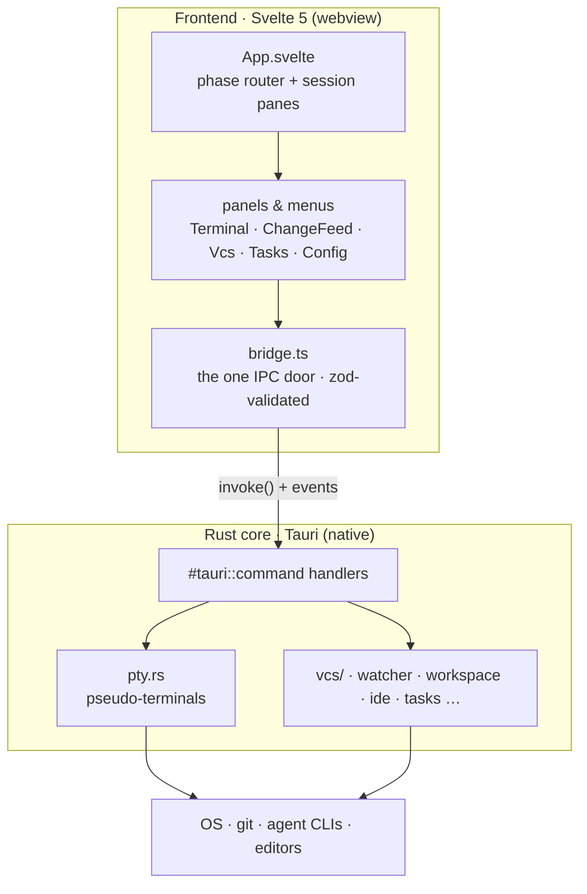
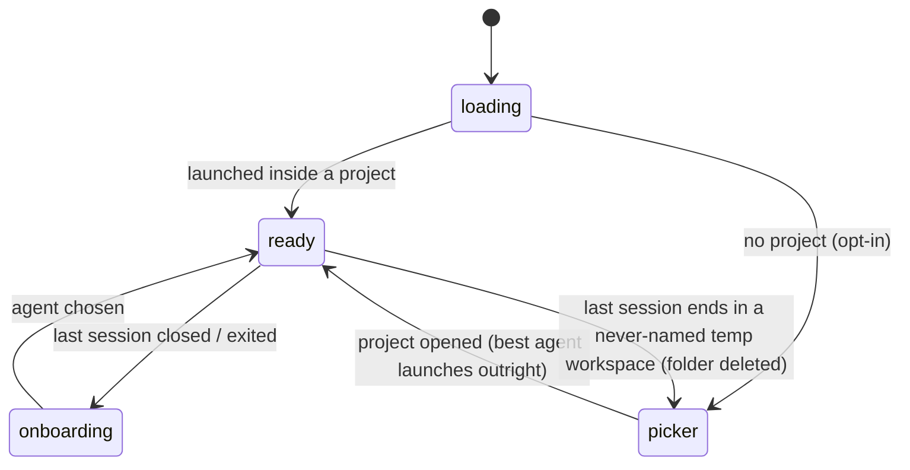
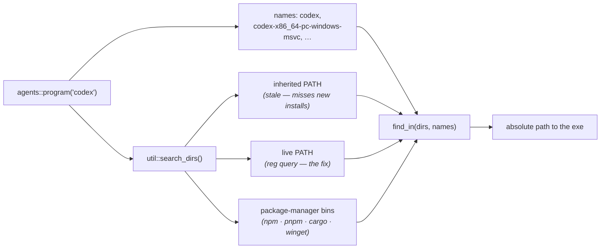
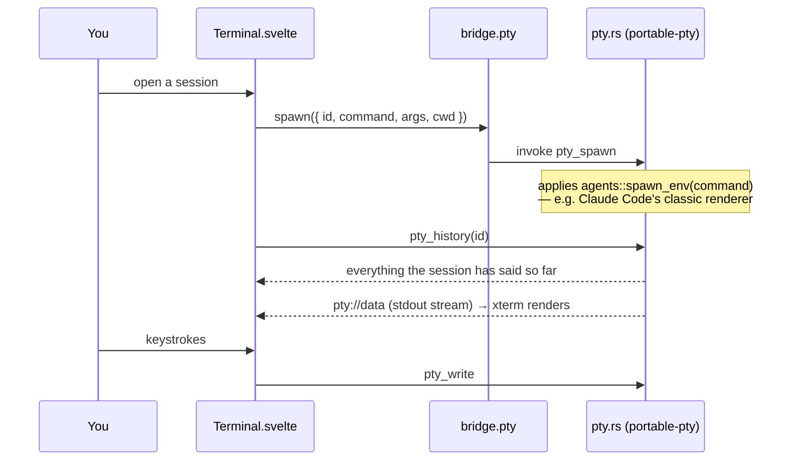
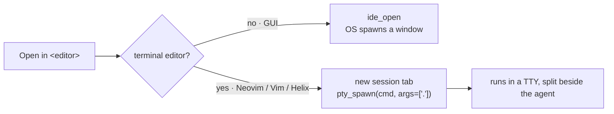
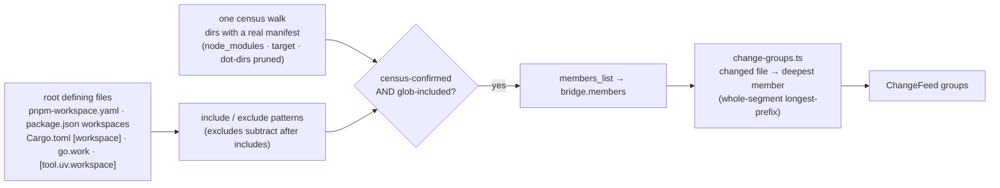
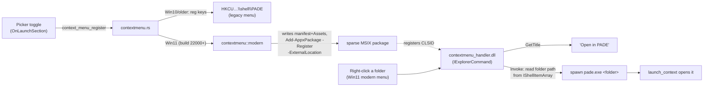

# PADE — architecture map

One-read orientation for agents and humans: every module, its single
responsibility, and who it talks to. `docs/requirements.md` holds the product
spec; `CLAUDE.md` holds the engineering rules. Keep this file in sync when a
module is added, split, or renamed.

Two layers, one boundary: the Svelte frontend never talks to Tauri directly —
every IPC call funnels through `src/lib/bridge.ts`, and every payload shape
lives in `src/lib/types.ts` as a zod schema.

## How it works

PADE wraps an AI coding-agent CLI (Claude Code, Codex, …) running **unmodified in
a real terminal** and builds a comprehension-first GUI around it. The big idea:
the agent writes; you stay the owner. So the screen is a live terminal on the
left and glanceable review panels on the right.

Under the hood there are just **two layers with one door between them**. The
Svelte webview owns everything you see; the Rust core owns everything native
(processes, the filesystem, git). They only ever speak through Tauri IPC, and on
the frontend that traffic is squeezed through a single module — `bridge.ts` —
which validates every payload with zod so bad data fails loudly at the boundary
instead of corrupting a panel.

### Screens are phases

`App.svelte` is a small state machine. It boots into one of three full-window
phases and never shows two at once.

Opening a project never blocks on a chooser: the saved per-project/default
agent — else the first installed agent in registry order — launches straight
into the workspace. `onboarding` is the *afterwards* screen, shown when the
last session is hand-closed or exits without a respawn. A **temp workspace
that never earned a name** skips both the respawn and onboarding: ending its
last session (closing the tab, or the agent quitting) hands the window back to
the picker and deletes the throwaway folder (`workspace_delete` — the backend
chdirs out first, so the cwd lock is released). One that was auto-named holds
real work and keeps the normal behavior.

### Finding an installed agent

Detection cannot trust `PATH`. A process inherits its environment **once**, at
launch — and a GUI app inherits it from the Explorer session that started it,
itself born at login. An installer's `PATH` edit lands in the registry, so a
running ADE would never see a CLI the user just installed, and Reload would keep
insisting it isn't there. Nor can detection trust the *name*: winget's Codex
package unpacks OpenAI's release binary verbatim, so on that machine `codex` is
spelled `codex-x86_64-pc-windows-msvc.exe` and no `codex.exe` exists at all.

So `util::search_dirs()` rebuilds the search path from its sources on every
detect — the inherited `PATH`, the **live** `PATH` read back out of the registry,
and the bin directories package managers use (npm, pnpm, cargo, bun, Homebrew,
and each winget package folder) — and `agents::program()` searches it for the
agent's canonical name first, then the `aliases` its installers are known to use.

One resolver, three callers — **detection** (is it installed?), **`pty.rs`** (what
to exec for a session), **`naming.rs`** (what to exec headlessly) — so an agent ADE
can *see* is always one it can *run*. Sessions exec the **absolute path**, never a
bare name: a bare name would be re-resolved by the child against that same stale
`PATH`, and an agent ADE had just listed could fail to start. Per-agent knowledge
(`spawn_env`, `oneshot_invocation`) stays keyed by the canonical command, never by
whichever file an installer happened to lay down.

### A terminal session is the unit of work

Each agent tab is a **session** — an id, the agent to run, and an optional
worktree cwd. `Terminal.svelte` mounts an xterm.js instance per session and asks
the core to spawn a PTY; bytes then stream both ways over Tauri events. All
sessions stay mounted so scrollback survives tab switching.

A spawn for a session that is already running is a no-op, so a terminal may be
mounting onto a conversation **in flight** — a hot-reloaded component, a reloaded
window. A PTY keeps no scrollback of its own, so without a replay that terminal has
nothing to paint and sits blank while the agent, quite happily, waits for input (it
reads as "the agent isn't starting"). `pty.rs` therefore keeps each session's raw
stream and hands it back through `pty_history`. Every chunk carries its position in
the stream, so a frontend already listening to the live feed while it asks for the
history can tell which chunks that history already contains from which are new.

That attach path is also what makes a whole-window reload survivable. The shell
persists its pane mapping (project + sessions + layout) in sessionStorage
(`session-restore`), and boots by intersecting it with the backend's live roster
(`pty_list`): whatever is still running is re-adopted pane by pane and replayed —
so an accidental reload (F5, a crash recovery) lands back inside the project
instead of orphaning invisible agents behind a picker. Liveness is never
persisted, only *read*: a **deliberate** leave (switching project, going back to
the picker, closing the window — the shell intercepts the close via
`onCloseRequested` and lets the window go only once its sessions are dealt with)
first waits for each session to go idle (`whenSessionIdle` — the `ready`
output-quiet signal, so nothing mid-flight is severed; the agent's own auto-save
plus `/resume` cover continuity) and then kills its PTYs, which is exactly why
nothing survives the next boot's intersection. And because sessionStorage dies
with the window, an app restart never resurrects agents the user meant to end.

A **fullscreen** program's history is not a document, though — it is a stream of edits
to a framebuffer, and a trimmed one replays as a torn frame. So `pty.rs` also tracks
which screen the program is on, and for the alternate one the terminal replays what it
has and then asks the program to repaint (a one-row resize and back): the program's own
model of the screen is the only complete copy.

### A terminal has two screens, and they invert every rule

How a resize must behave is a property of **which screen the program paints on**, not
of the emulator — and ADE hosts both, so `Terminal.svelte` watches
`buffer.onBufferChange` and switches policy on it.

| | **Normal screen** (a shell, an agent with no fullscreen mode) | **Alternate screen** (Claude Code as ADE runs it, Codex, aider, a pager) |
| --- | --- | --- |
| What it holds | A real document, with real scrollback | A framebuffer the program owns and diffs against its own model of |
| Who paints a row | The terminal — so xterm can rewrap the text itself, continuously, like a web page | **Only the program** |
| Grid refit | Every frame, so the text tracks the drag | **Flow-controlled**: one resize in flight at a time, the next only once the program has finished painting the last (and never more often than `ALT_FIT_MIN_INTERVAL_MS`). Resize it faster than it can follow and its model desyncs — measured, that stops it painting altogether and the pane goes blank for good. Freezing the grid instead would be safe, but then the TUI only updates when you let go |
| `SIGWINCH` | **Width only**, debounced; the height never. An inline document wraps to the width, but how much of it you can see is the terminal's business — and every `SIGWINCH` makes the agent re-lay-out (dropping a line, which steps the text above it) and reprint its whole static history (a per-frame drag left **52** orphaned conversations in the scrollback) | **Cols and rows, immediately.** A size the program has not heard is a row nobody paints |
| Grid anchor | Top while the conversation fits, bottom once it scrolls — pinning the end you are looking at, so the sub-cell remainder and the row xterm scrolls away cancel out | **Top.** The program's frame is rigid, so the unpinned edge is the one that jumps a row on every boundary: pinning the top nails the conversation (measured: not one pixel of movement across three row changes) and leaves the remainder as an invisible strip of terminal background at the bottom. While the program is catching up the grid can be taller than the pane, which would cut its status line off — so it is scaled to fit (~3% at worst), back to exactly 1 the moment it catches up |

ADE runs Claude Code **fullscreen** (`CLAUDE_CODE_NO_FLICKER=1` in the registry): the
polished TUI, with mouse support and flicker-free output. The cost is deliberate — on
the alternate screen a resize cannot flow like a web page, because the content is on
the far side of the PTY. The normal-screen column is not dead code: it is what every
shell session runs, and what Claude Code runs again the moment the renderer is flipped
back.

One xterm patch backs this (`patches/@xterm__xterm@…`), making a row resize a lossless
round trip. Stock, a **shrink** `pop()`s the line below the cursor — while its own
comment claims that line is blank — which destroyed the agent's `accept edits` hint;
and a **grow** refuses to reclaim the scrollback whenever anything sits below the
cursor, pushing blank lines under the conversation instead, so shrink→grow marched the
conversation off the top and left the pane full of dead space.

`docs/terminal-rendering.md` has the measurements and the approaches that were
tried and rejected.

### Opening a project in an editor

"Open in editor" forks on **how the editor runs**. A GUI editor (VS Code,
JetBrains, Zed…) is launched by the OS and detaches into its own window. A
**console editor** (Neovim, Vim, Helix) needs a real TTY, which the OS spawn
can't give it — so PADE opens it in a **new terminal tab** right beside the
agent, reusing the very same PTY machinery sessions use. The `ide.rs` `family()`
table is the single place that knows which editors are terminal-based, and it
also drives add-an-editor validation and jump-to-line launching (DRY).

### The Change Feed groups by manifest, not by name

A directory called `frontend/` proves nothing — the ground truth of "what
package owns this file" lives in **manifest files**. So the Change Feed's
project buckets come from `members.rs`: one census walk records every directory
holding a real package manifest (noise pruned), the root's workspace-defining
files declare the member patterns, and a folder is a member **IFF the census
confirms it**. The frontend (`change-groups.ts`) then assigns each changed file
to its deepest enclosing member by whole-segment longest-prefix — `apps/web`
never captures `apps/web-admin` — with the repo root as the always-present
fallback bucket. A workspace with no confirmed members (nothing declared) keeps
the old `apps/`·`packages/`·`services/` folder-name convention, so single-repo
behavior is unchanged while a root-level-package workspace (`frontend/`
`backend/` `shared/` in `pnpm-workspace.yaml`) now splits correctly.

Everything below is the module-by-module map: each file, its single
responsibility, and who it collaborates with.

## Frontend — app shell

| Module | Responsibility | Collaborators |
| --- | --- | --- |
| `src/main.ts` | Entry: mounts `App`, loads the theme | `App.svelte`, `theme.css` |
| `src/theme.css` | M3 Expressive tokens, global keyframes, base document styles | everything |
| `src/App.svelte` | App-shell orchestrator: phase routing (loading → picker / onboarding / ready), spawned-window boot, reload re-attach (a boot first re-adopts the backend's still-live sessions via `session-restore`, before any stale `w=` query routing — and the shell keeps that `w=` query rewritten to the project actually on screen, so even a snapshot-less reload lands right), session list + split panes, launch flows, auto-close-on-exit (respawn the same agent when the last session self-exits, e.g. Ctrl-C; a never-named temp workspace instead returns to the picker and is deleted), in-window project switch, leave-to-picker and an intercepted window close (deliberate leaves — one at a time — gracefully kill every session of the project being left — idle-first via `whenSessionIdle` — so no agent keeps running, or cwd-locking, a workspace the window has moved on from), side-panel host; wires the extracted concerns below | `SessionTabs`, panels, `auto-name`, `session-restore`, `stores/handoff`, `workspace-relocate`, `send-shortcut`, `tab-shortcuts`, `stores/toast` |
| `src/lib/SessionTabs.svelte` | Session tab strip: pill/dot/"+N" tiers, off-layout measurement, add-agent menu; each full tab's agent glyph is tinted by its context-window fill (the `--context-*` gauge — colour only, no number) and flashes red (steady red under reduced motion) while its agent waits on a multiple-choice answer, until that tab is looked at or answered | `tab-fit`, `stores/sessions`, `stores/context`, `stores/sessionAttention`, `context-level`, `agent-icon` |
| `src/lib/AppMenu.svelte` | Top-bar project switcher: an Open-windows list (focus any window; cycle with Ctrl+Alt+[ / ]), a filter (Ctrl P — a capture-phase shortcut so the terminal can't swallow it), pinned/recent rows with truncation-`title` tooltips on clipped paths and a per-row kebab (pin/unpin, remove-from-list, delete-directory) and drag-reorderable pins, then open-a-project / new-window actions. Row metadata (open windows, language kinds, branch chips) is fetched on each open and re-fetched on `git://state` while the menu is open, so a branch switch updates the chips in place. **Every list change animates**: each row carries a stable `view-transition-name` and the mutation runs inside a view transition scoped to the rows container (`switchList.startViewTransition` — never `document`, so the live-repainting terminal is never snapshotted/ghosted), so a pinned row glides Recent→Pinned and a removed/deleted row morphs out (reduced motion runs the update directly). The kebab's **delete-directory confirms in place**: it owns a `nested` `ConfirmDialog` that sits inside this popover, so the switcher stays visible (dimmed) behind the prompt; the shell only performs the removal | `bridge`, `drag-reorder`, `ConfirmDialog`, `truncation-tooltip` |
| `src/lib/UsageMeter.svelte` | Usage/quota pill in the top bar, grouped **per running agent** (each agent's real limits where its vendor exposes them — Claude/Codex/Copilot — an honest "unknown" otherwise): few-agents chips vs many-agents pills + a "+N" overflow, opening the per-agent details dialog | `bridge.usage`, `usage-groups` |
| `src/lib/DesignMenu.svelte` | Quick-launch menu for AI design tools | `bridge.design` |
| `src/lib/IdeMenu.svelte` | Split launcher for the project: opens the project's editor — resolved through the shared `stores/editors` ranking (SSOT with the Change Feed's reveal), GUI editors via the OS, console editors handed back to `App` for a terminal tab — and always exposes a drop-down whose final action reveals the project in the file explorer; picking from the list persists an explicit per-project choice (`ide_choose_editor`) that then leads the ranking everywhere | `stores/editors`, `bridge.ide`, `bridge.os` |
| `src/lib/RunnerDock.svelte` | Task-runner dock: streaming output rows (each line's ANSI/SGR codes parsed by `lib/ansi` `parseAnsi` into coloured spans from the shared terminal palette — `runner.rs` pipes the child's raw output, colours and all, so a dev server's banner renders in colour instead of raw escapes), resize, pipe-to-agent; keeps its own 2-D-grid pointer drag rather than the single-axis `drag-reorder` engine (the dock wraps to multiple rows) | `stores/runners`, `ansi` |
| `src/lib/CommitModal.svelte` | Commit-dialog orchestrator: native `<dialog>` plumbing, header, selection + diff-load state machine | `commitModal/FileList`, `commitModal/DiffPane`, `bridge.vcs`, `diff` |
| `src/lib/commitModal/FileList.svelte` | The commit's changed-files tablist: kind badges, stats, roving-tabindex keys | `paths` |
| `src/lib/commitModal/DiffPane.svelte` | Path bar + the selected file's diff with loading / failed / large-file states (presentation only) | `DiffView` |
| `src/lib/DiffView.svelte` | The one renderer for a parsed diff, unified or split — line washes, hunk headers, a per-side old/new line-number gutter (tabular, unselectable), `data-newline` hooks; every line prints in full (long lines wrap, never clip or side-scroll); callers own the scroll container and interactivity | `diff`, `ColorText`; used by `ChangeFeed`, `vcs/ChangesSection`, `commitModal/DiffPane` |
| `src/lib/ConfirmDialog.svelte` | Shared in-app confirmation prompt (native `<dialog>`): destructive prompt with caller-owned busy + error states — replaces the OS popup. Two shells around one card: the default modal `showModal()`, or — with `nested` — a `<dialog>`-as-popover opened inside an already-open menu popover, so that menu stays visible (dimmed) behind it instead of being force-closed (`showModal()` closes every open popover) | `Icon` |
| `src/lib/SessionBadge.svelte`, `Icon`, `Logo`, `BrandMark`, `ColorText` | Small presentational atoms | — |

## Frontend — extracted concerns (logic modules)

| Module | Responsibility | Collaborators |
| --- | --- | --- |
| `src/lib/bridge.ts` | The single UI ↔ Rust boundary; zod-validates every response | `types`, `@tauri-apps/api` |
| `src/lib/types.ts` | Zod schemas + TS types for every IPC payload; shared enums | `bridge`, everywhere |
| `src/lib/validate.ts` | User-input schemas (trust boundary) + `parseInput` / `nameError`; owns the clone-URL shape knowledge — `CloneUrl` (https / ssh / scp-like), `GitUsername`, `GitSecret`, `isSshCloneUrl`, `repoFolderName` | form components |
| `src/lib/tab-fit.ts` | Pure greedy packing of session tabs into pill/dot/overflow tiers | `SessionTabs` |
| `src/lib/context-level.ts` | Pure context-window severity: the shared auto-handoff threshold + `contextLevel(pct)` → ok/warning/critical gauge step | `SessionTabs`, `stores/handoff` |
| `src/lib/ansi.ts` | `stripAnsi` — remove a terminal's ANSI/control sequences so text matchers see the glyphs the TUI wrote, not the colour/cursor codes interleaved with them | `choice-prompt`, `task-detect` |
| `src/lib/choice-prompt.ts` | Pure, conservative detector (`detectChoicePrompt`) for the agent's on-screen multiple-choice prompt in the PTY stream: strip ANSI (`ansi`), then require the `❯` selection cursor on a numbered option plus ≥2 numbered options, so ordinary numbered prose never trips it | `ansi`, `stores/sessionAttention` |
| `src/lib/initial-prompt.ts` | Pure `isTrustGate` — recognizes a fresh agent's first-run "trust this folder?" gate (a `choice-prompt` whose text mentions trust) so the terminal can auto-accept it before delivering a new session's first prompt. A deliberate, documented coupling to the CLI's observable wording, scoped to that one always-safe gate | `choice-prompt`, `ansi`, `Terminal` |
| `src/lib/task-detect.ts` | Pure `isTaskInvocation` — whether a known task's command appears whole (not a longer sibling) in a line of agent output; strips ANSI (`ansi`) and accepts the agent's `Tool(command)` paren wrapping as a word boundary | `stores/taskRuns` |
| `src/lib/drag-reorder.ts` | Pointer-drag reorder engine (DOM + geometry), reproducing the design mockup's: lifts a tile, slides its siblings, and on drop **springs the lifted tile from the release point to its slot** (`cubic-bezier(.34,1.35,.5,1)` + shadow fade, committing the order ~300ms later — the engine owns the whole drop animation, so the lists carry no `animate:flip`). Supports drop-outside (a tab onto the panes → split; a pane header onto the tab strip → pop back to a tab). Raises a transparent **drag shield** so the grabbing cursor shows over every surface (xterm canvases included) and hit-tests through it with `elementFromPoint`; **unclips** overflow ancestors so a tile dragged out of a scroll strip isn't cut off; delegates the pure order/index math to `reorder` | `SessionTabs`, `Terminal`, `App`, `reorder` |
| `src/lib/reorder.ts` | Pure, DOM-free order/index math for drag-to-reorder + drop-to-split (`reorderedIds`, `insertionIndex`, `paneInsertIndex`, `paneDropSide` — the one which-half-of-a-pane decision behind both the live highlight and the drop), the `DropSide` enum, and `committedOrderOnDrop` — the full-length order a drop commits (the unchanged list for a same-slot release, `null` only on cancel) so a no-op drop can never drop a pill | `drag-reorder`, `App` |
| `src/lib/auto-name.ts` | Temp-workspace auto-naming: distinct-file counting, once-per-workspace naming call | `bridge.feed/workspace`, `paths` |
| `src/lib/workspace-relocate.ts` | Move/rename/delete with cwd-lock handling: kill locking sessions → backend op → resume remapped (delete has nothing to resume and drops the project) | `bridge`, `stores/sessions`, `stores/context` |
| `src/lib/send-shortcut.ts` | Global send-from-IDE shortcut: clipboard → active agent input | `bridge.pty`, `stores/toast` |
| `src/lib/session-restore.ts` | Re-attach after an accidental reload: persists the window's pane mapping (project + sessions + panes, incl. each session's `conversationId`) in **sessionStorage** — survives a WebView reload, dies with the window, so an app restart never resurrects ended agents — and restores only the intersection with the backend's live roster (`pty.list`), the sole authority on liveness. A deliberate leave kills its PTYs first, so nothing survives the intersection — no separate leave flag | `bridge.pty`, `types`, `App` |
| `src/lib/mcp-restart.ts` | Pure logic behind auto-restarting agents when a project's MCP servers change: `mcpRestartTargets` picks the sessions a change affects (the governed agents, whose working dir IS the changed dir — a worktree keeps its own config — and that carry a resumable `conversationId`), and `rekeyLayout` re-keys those sessions across the pane layout (new id → terminal remounts and resumes; `initialPrompt` dropped). `App` owns the reactive side (kill PTYs, toast, assign); these stay pure and unit-tested | `paths`, `types`, `App` |
| `src/lib/tab-shortcuts.ts` | Tab keyboard shortcuts: two pure matchers — `matchTabShortcut` (chord → new / close / cycle / launch-menu action) and `matchTabSelection` (Ctrl+1..8 → that tab, Ctrl+9 → the last) — plus the capture-phase registrar wiring both to the app's handlers | `focus`, `App` |
| `src/lib/pane-nav.ts` | Pure previous/next/nth pane lookup for the split-pane keyboard nav (`previousPaneId`/`nextPaneId` wrap; `paneIdAt` bounds-checks) | `pane-shortcuts` |
| `src/lib/pane-shortcuts.ts` | Split-pane keyboard shortcuts — the sibling of `tab-shortcuts`: pure `matchPaneShortcut` (Ctrl+[ / Ctrl+] cycle, Ctrl+Alt+1..9 → nth pane, Ctrl+Alt+W → close the active pane) + a capture-phase registrar resolving the target pane through `pane-nav` | `pane-nav`, `focus`, `App` |
| `src/lib/focus.ts` | `isEditingText` — whether focus sits in a real editable field (not xterm's helper textarea); the shared guard both shortcut registrars check before swallowing a chord | `tab-shortcuts`, `pane-shortcuts` |
| `src/lib/paths.ts` | Path helpers: `baseName`, `parentDir`, `displayName`, `isTemporaryWorkspace`, `normalizePath` | many |
| `src/lib/diff.ts` | Pure unified-diff pipeline: parser + side-by-side rows, and `unifiedDiff` — a git-free LCS line-diff generator (shared prefix/suffix trim → LCS on the changed middle → context-bounded hunks) that turns the Change Feed's baseline-vs-current texts into the same unified-diff string the parser reads | `DiffView`, `ChangeFeed`, `VcsPanel`, `CommitModal` |
| `src/lib/change-groups.ts` | Pure grouping of Change Feed events into project buckets, summing each group's line deltas. Ground truth first: with manifest-confirmed workspace members (`bridge.members` ← `members.rs`) a change buckets under its **deepest enclosing member** (whole-segment longest-prefix, so `apps/web` never captures `apps/web-admin`; outside every member → the repo). Only a workspace with no confirmed members falls back to the folder-name convention — a change under an `apps/`·`packages/`·`services/` container groups by its member folder (an `@scope/name` kept whole), else the repo itself | `ChangeFeed`, `bridge.members` |
| `src/lib/file-type.ts` | Pure extension → file-type badge (short label + colour tone) for a Change Feed card's language chip | `ChangeFeed` |
| `src/lib/format.ts` | Locale-aware number formatting | UI counts/stats |
| `src/lib/usage-groups.ts` | Pure per-agent usage model: running sessions → deduped, worst-first `AgentGroup`s (per-agent limits when its account resolves, else "unknown"), the severity/spotlight/legend view-model, and the agent→icon map | `UsageMeter` |
| `src/lib/language-icon.ts` | Pure project-kind → language-logo map; an unknown kind falls back to the generic code glyph (the kind registry itself lives in Rust — the picker derives its rows from `ide_kinds`) | picker `EditorsSection` |
| `src/lib/errors.ts` | `errorMessage` — one reading of a thrown IPC rejection into user-facing text | any catch block |
| `src/lib/motion.ts` | JS exit/reveal transitions CSS can't own (the node leaves the DOM before a CSS transition could run), reduced-motion aware: `revealBlock`, `collapseRow`/`expandRow` (block axis), and `collapsePane` (inline axis — a closing split pane collapses its width so the surviving panes glide across to fill) | picker lists, `App` |
| `src/lib/roving-tabs.ts` | `rovingTablist` Svelte action — the ARIA tabs keyboard pattern for pill tablists: arrows move **and activate** with wrap, Home/End jump to the ends, Tab leaves the list (markup keeps the roving tabindex) | picker `QuickStartSection`, `OnLaunchSection` |
| `src/lib/colors.ts` | Color-token detection + `var()` tracing for swatches | `ColorText`, viewers |
| `src/lib/highlight.ts` | Dependency-free syntax highlighting for code/config/diff viewers | viewers |
| `src/lib/terminal-links.ts` | Clickable-URL link provider for xterm: rejoins **both** soft-wrapped (`isWrapped`) and hard-wrapped (a full row → glyph at column 0) rows so a wrapped URL activates in full — the stock web-links addon only does soft wraps, truncating a URL a fullscreen agent wrapped at the edge; URL pattern / validity / cell back-mapping ported from `@xterm/addon-web-links` | `Terminal` |
| `src/lib/terminal-theme.ts` | Pure design-tokens → xterm theme mapping, every color converted to parse-safe hex (`xtermSafeColor`: modern `hsl()` → `#rrggbb[aa]` — xterm's own parser silently drops any non-opaque color outside `#hex`/legacy `rgb()`, which lost the alpha selection token). Keeps the *terminal surface* truthful to PADE's scheme; the *agent's own* palette can't hear it through ConPTY (it consumes the agent's OSC 11 query and xterm's ?997 report — verified live), so that half of the sync rides each agent's config file instead (`theming.rs`) | `Terminal` |
| `src/lib/prefs.svelte.ts` | Reactive appearance/editor prefs, applied as CSS custom properties | `App`, `bridge` |
| `src/lib/discord-presence.ts` | Maps app state (open project + prefs) → Discord rich-presence bridge calls; the one seam `App` drives so the presence concern stays out of the shell. Best-effort — IPC failures (Discord closed) are swallowed | `bridge.discord`, `paths`, `App` |
| `src/lib/truncation-tooltip.ts` | Svelte attachment that adds a native `title` tooltip to an element only while its text is clipped — width measured with the Canvas text-metrics API against the element's font (deterministic, no `scrollWidth` reflow), re-checked when a `visible` flag flips (the moment a row inside a `display:none` popover gains a real width), so no observer is needed. `title` (not the `[data-tooltip]` bubble) so it floats above the UI rather than being trapped in the popover's top layer | `AppMenu` |

## Frontend — stores (cross-component state)

| Module | Responsibility |
| --- | --- |
| `src/lib/stores/sessions.svelte.ts` | Per-session status (working/ready/exited), plus the graceful-leave gate: `whenSessionIdle` resolves the moment a session turns idle (`ready` — the Terminal's output-quiet signal — or exited/dropped), event-driven with a timeout cap, so a deliberate leave can wait before killing |
| `src/lib/stores/feed.svelte.ts` | Persistent Change Feed events: owns the single live `feed://change` subscription (started once, never torn down) so events accumulate while the panel is unmounted and survive its remount — the `ChangeFeed` panel switches in/out of the DOM on every side-panel change, so component-local state emptied the feed. Holds the newest-first cap + scratch-file filter; `retarget(project)` clears on a workspace switch. Also subscribes to `feed://ignore-changed` (a `.gitignore` touched, a `git init`): it re-asks the backend (`feed_ignored`) which of its shown paths the fresh rules exclude and drops those events, so the feed re-filters live instead of only filtering what arrives next |
| `src/lib/stores/sessionAttention.svelte.ts` | Per-session "awaiting a multiple-choice pick" flag: watches the PTY stream once (`choice-prompt`) and reconciles the flag against status + focus (cleared when the tab is active or the agent goes back to working); drives SessionTabs' red flash |
| `src/lib/stores/context.svelte.ts` | Per-session context-window fill from two signals: the agent's own parsed readout, else a rough PTY-byte estimate. `contextPct` (parsed-or-estimate) tints the soft tab gauge; `measuredContextPct` (parsed only) is what auto-handoff / usage-resume / API-error retry gate on — the byte estimate over-counts a fullscreen agent's repaints, so it must never end a session |
| `src/lib/stores/handoff.svelte.ts` | Auto-handoff: near-limit scan, handoff-doc wait, successor launch, consumed-doc deletion (via the narrow `handoff_doc_delete` command), and a `force()` entry the usage-resume flow calls |
| `src/lib/stores/usageResume.svelte.ts` | Usage-limit auto-resume: sniffs the CLI's "limit reached" stop message from the PTY stream, confirms against the OAuth usage window, schedules the resume at window reset — "continue" in place, or `handoff.force()` when the context is nearly full |
| `src/lib/stores/runners.svelte.ts` | Task-runner rows + backend stream subscription |
| `src/lib/stores/taskRuns.svelte.ts` | Reflects a known task the agent runs (spotted in its PTY output via `task-detect`) as "running" in the Tasks panel — status only, cleared when the session goes idle or exits; no process is spawned |
| `src/lib/stores/sidePanel.svelte.ts` | Active side-panel header (count + refresh action) |
| `src/lib/stores/editors.svelte.ts` | The project's ranked editors (SSOT): one cached `ide_suggest` per project, coalescing simultaneous resolves (IdeMenu + Change Feed mounting together run one census, not two) and reused across panel remounts; `chooseEditor` writes an explicit pick through `ide_choose_editor` and re-resolves so the choice wins on every surface at once |
| `src/lib/stores/toast.svelte.ts` | Transient status toast (single reset-on-show timer) |

## Frontend — panels

| Module | Responsibility |
| --- | --- |
| `src/panels/Terminal.svelte` | xterm.js terminal bound to one PTY session; owns the document-style reflow (grid fit, anchor, settle-debounced `SIGWINCH`); makes plain-text URLs clickable via `terminal-links` (whole wrapped URL → system browser) and OSC-8 hyperlinks via its own `linkHandler`; themes xterm from the design tokens (`terminal-theme`) and re-themes on every scheme flip — except a pane whose agent's theme is fixed at spawn (`Agent.themeFixedAtSpawn`, Codex), which stays pinned to its spawn scheme so the running TUI keeps a readable background (the agent's own palette syncs separately through its config file — `theming.rs` — because ConPTY consumes the terminal-protocol channel). **Delivers a new session's first prompt**: rather than firing it on mount (where it would collide with the agent's first-run trust gate), it watches the stream — auto-accepts the trust gate (`initial-prompt`), then once the agent has settled at its REPL pastes the prompt as a bracketed paste and submits it with a separate Enter |
| `src/panels/ChangeFeed.svelte` | Live file-change feed, grouped by project (`change-groups`, fed the manifest-confirmed members from `members.list` — refetched on a project switch, convention fallback on failure) under role-badged headers that carry the workspace's git branch as a subtitle (`vcs.branchOf`, refreshed on mount / project switch and live on `git://state` — a branch switch or `git init` updates it in place) with a per-project chip filter, a change-kind filter, and per-card file-type chips (`file-type`); expanding a card fetches the git-free session-baseline preview (`feed.diff`) and renders it through the shared `unifiedDiff` → `parseDiff` → `DiffView` path. An **image change** (png/jpg/gif/webp/avif/bmp/ico/svg — `lib/preview` `isImagePath`) instead renders an inline preview: the file's bytes fetched as a base64 data URL (`feed.image` ← `feed_image`) and shown via `` on a theme-aware checkerboard, only on expand — SVG goes through the same `` data URL, never inlined as markup, so it runs no scripts. A **markdown or HTML change** (`lib/preview` `isMarkdownPath`/`isHtmlPath`) gets a **Code | Preview** toggle: Code is the diff (default), Preview renders the file's current text (`feed.text` ← `feed_text`) inside a **sandboxed `<iframe>`** (no `allow-scripts`/`allow-same-origin`, plus a `default-src 'none'` srcdoc CSP) — markdown is turned to HTML by the hand-rolled `lib/markdown` (no parser dependency; the PowerToys approach translated to the web) wrapped in a vendored M3 stylesheet, an HTML file is shown as-is; both inert, so untrusted project content runs no scripts and loads no external refs. The toolbar's **Sync all** button (shown only for a repo with a remote, re-checked live on `git://state`) fast-forwards the workspace from `origin` (`vcs.pull`) with an in-flight spinner and a status toast |
| `src/panels/VcsPanel.svelte` | Git-panel orchestrator: fetch + watcher-debounced refresh (on `feed://change` and `git://state`, so a branch switch or remote change refreshes the panel even when no watched file moved) + panel header; composes the sections below |
| `src/panels/TasksPanel.svelte` | Detected project tasks, run as dock runners |
| `src/panels/ConfigPanel.svelte` | Read-only view of the active agent's config files |
| `src/panels/Onboarding.svelte` | Agent picker shown after the last session is closed or exits — never on the way into a project |
| `src/panels/ProjectPicker.svelte` | Picker orchestrator: owns settings + refresh + the shared workspace lifecycle, hosts the delete `ConfirmDialog`, and keeps the page live — it watches the parents of its rows (`dirs`) and re-prunes on any change, so a folder deleted outside PADE leaves the list on its own; composes the sections below |

### Git-panel sections (`src/panels/vcs/`)

| Module | Responsibility |
| --- | --- |
| `chrome.css` | Shared panel chrome (group headers, sha/author line, empty state), selector-scoped under `.vcs` |
| `RestoreSection.svelte` | Restore a version: natural-language query → ranked candidates → checkout |
| `ChangesSection.svelte` | Unreviewed/staged groups + the selected file's inline diff (unified + split) |
| `CommitLog.svelte` | Recent commits with keyboard navigation, GitHub links (the backing remote URL re-read live on `git://state`, so a `remote add`/`remove` flips the links in place) and the detail modal |

### Project-picker sections (`src/panels/picker/`)

| Module | Responsibility |
| --- | --- |
| `chrome.css` | Shared picker chrome (base fields/buttons, the `.path-input` monospace path field, kebab + popover menus, rows, eyebrows, the `.pill-tabs`/`.pill-tab` tablist), selector-scoped under `.picker` so all sections inherit one copy |
| `PathCombobox.svelte` | Shared folder-path field with directory autocomplete: owns the debounced `workspace_probe_path` call, the child-folder listbox as a top-layer anchored popover (arrow/Enter to accept, Tab to accept-and-drill a sub-folder, Ctrl+Space to re-open, Escape to dismiss), and hands its full probe result back via `bind:probe` so each host builds its own validation. Used by `QuickStartSection` (Local) and `RootsSection` (add root) — one home for the completion behaviour |
| `QuickStartSection.svelte` | Tabbed "Get started" card — three ways in sharing one card behind a pill tablist (`rovingTablist`): **New** (root select + project name — a blank name falls through to a throwaway temp workspace — + optional first prompt + an **Agent** row — shared `AgentChips`, shown only when more than one agent is installed — whose pick launches the new project via `OpenTarget.agent`), **Local** (open an existing folder — a shared `PathCombobox` whose monospace path is existence-gated through the `workspace_probe_path` debounce and offers the same directory autocomplete as the add-root field, and a folder dragged from Explorer/an IDE fills it via the `dragDrop` bridge channel over Tauri's native DnD events, with a hover affordance), **Clone** (gated on `vcs_git_installed` with an install-git fallback card; the typed URL is probed live — `vcs_probe_remote`, a debounced `git ls-remote` — and only a repository that answers auto-fills the folder name via `repoFolderName`, until edited; an SSH-style URL with no key on disk — `vcs_has_ssh_key` — swaps in an HTTPS-credentials panel; submits `vcs_clone`). All three panels stay mounted, overlaid in one grid cell — a tab switch cross-fades in place (state survives switching) while the container's measured height (ResizeObserver → CSS transition) glides between panel sizes |
| `OnLaunchSection.svelte` | Start-mode toggle, auto-name checkbox, Explorer context-menu toggle |
| `RecentSection.svelte` | Recent rows with tags + inline-rename form; a removed row collapses out (`motion.collapseRow`) |
| `AgentsSection.svelte` | Default-agent chooser (shared `AgentChips`) with rescan/skeleton states |
| `AgentChips.svelte` | Shared agent choice-chip radiogroup — one pill per installed agent (brand glyph + label), the selected one edged in primary over its container; reused by `AgentsSection` (default agent) and `QuickStartSection`'s New-panel Agent row (its `compact` variant) |
| `EditorsSection.svelte` | Editor-rules engine rows — kinds fetched from the backend `ide_kinds` registry (web/python/java/go/rust/android plus C/C++, C#/.NET, PHP, Ruby), each row led by its language logo (`language-icon`) — + popover selects whose trigger and options carry the editor's brand mark (`ide-icon`) + "Add editor…" by executable path (validated, inline status) |
| `RootsSection.svelte` | Root folders: add (typed path with live, existence-driven validation via the shared `PathCombobox` directory autocomplete, or the native picker) / remove + detected projects per root |
| `RowMenu.svelte` | Shared kebab popover: reveal actions + owned-workspace lifecycle entries |
| `lifecycle.svelte.ts` | Owned-workspace rename/move/delete flows + inline-rename form state, shared by Recent and Roots; owns the delete confirmation state (target / in-flight / error) that `ProjectPicker` renders as one `ConfirmDialog` |

## Rust core (`src-tauri/src/`)

`lib.rs` only wires modules and registers commands; `main.rs` is the binary
entry. Each concern is one module:

| Module | Responsibility |
| --- | --- |
| `pty.rs` | PTY host — runs agent CLIs (and console editors) unmodified in pseudo-terminals (portable-pty), applying the registry's per-agent spawn env (plus `theming.rs`'s per-scheme theme env for the caller's scheme), and — on **Windows + a light scheme**, for an agent whose composer box follows the *detected* terminal background (`agents::needs_light_console_fix`, i.e. Codex) — prefixing the launch with `cmd /c color F0 & …` so the ConPTY console buffer reads light before the agent probes it (the only lever: ConPTY hard-codes a BLACK buffer that no env/arg/config/OSC channel can change; each token stays a separate argv entry so portable-pty quotes the path cmd-compatibly); and, for an agent that supports it, binding the session to a caller-chosen **conversation id** (`agents::session_id_flag` → `claude --session-id <uuid>`, so a restart resumes that exact conversation); keeps each session's replayable history so a terminal can attach to a conversation in flight; `pty_list` enumerates the live sessions (id, spawn command, cwd) — the re-attach roster a reloaded frontend intersects its persisted pane mapping with (`session-restore`); dropping a session kills **and reaps** its child (closing the PTY only hangs it up, and a survivor keeps its cwd locked), so `pty_kill` frees the workspace and `kill_all` leaves nothing behind on app exit; a per-session reaper thread polls the child because a self-exit never EOFs the reader on Windows (conhost holds the ConPTY open) — reaping drops the session, whose closing pipe is what emits `pty://exit` |
| `discord.rs` | Discord Rich Presence: talks the Discord desktop client's local IPC socket directly (Windows named pipe / Unix domain socket) in pure `std` — no crate — to report "Playing PADE" with an optional project line and the project's **language** as a small overlay icon + status line (VS-Code style; the frontend maps `ide.projectKinds` → an art-asset key). The socket I/O is **blocking** and Tauri runs sync commands on the UI thread, so the state owns a **dedicated worker thread**: `discord_set_activity`/`discord_clear_activity` only enqueue onto a channel and return at once, and the worker holds the connection and applies updates serially off the UI thread (a stalled read can never freeze the window). Lazily connects, reconnects when Discord restarts, and holds the run's start timestamp steady so the elapsed timer doesn't reset per project switch. Best-effort (a closed Discord is a quiet error). Ships one public `APPLICATION_ID` (the VS-Code-extension model — registered once, zero per-user setup) |
| `watcher.rs` | Filesystem watchers (notify): the recursive one feeding the Change Feed — armed on the workspace path the frontend passes `watch_start` (the open project's root, threaded from `ChangeFeed`, **not** the process cwd — so a cwd that has drifted from the displayed workspace never points the feed at the wrong tree) and re-rooted on a project switch (a call for a new root drops the old watcher and its per-file bookkeeping and re-arms). **All watch state is per window** (`WatcherState.windows`, keyed by window label): every PADE window opens its own workspace but all share one backend process, so a single global watcher slot could arm only one project at a time — a second window's `watch_start` tore down the first's watch (its edits never surfaced) and the one live watcher broadcast into every window's feed. Each window's watcher (and its git-state and picker `dirs` watch, and their per-file bookkeeping — line counts, baselines, ignore policy, MCP baseline) lives under its label, and every event it produces is routed back to that window alone with `emit_to(<label>, …)` (never `emit`, which broadcasts to all) so two windows on different projects never cross-contaminate; the frontend's `bridge.on` correspondingly listens **scoped to its own window label**, so an app-wide `emit` still reaches it but a sibling's targeted emit does not. Closed windows have no teardown hook, so `watch_start`/`watch_dirs` prune the entries of windows no longer live (dropping their watchers and retiring the paired coalescer threads). It also excludes what the project itself would ignore, via a **live ignore policy**: in a git work tree it defers to git's own rules (`git -C <root> check-ignore`, memoized per path, so nested `.gitignore`, `.git/info/exclude`, `core.excludesFile`, and negations all count); with no git it falls back to a set of directory names inferred from the manifests at the root (`package.json`→`node_modules`…, `Cargo.toml`→`target`, …) unioned with the always-on `IGNORED` baseline **plus the root `.gitignore`'s own rules** (`gitignore.rs` — a scaffolded project knows what it will generate before `git init` runs) — that cheap baseline pre-filter runs first in both modes, so a giant dir never reaches git. The policy is **recomputed** whenever the rules could have changed — any `.gitignore` edited, created, or deleted under the root (the recursive watch already sees both the existing file changing and one appearing), and a mid-session `git init` (piggybacked on the git-state coalescer's re-arm) — and each recompute announces payload-free **`feed://ignore-changed`**, on which the frontend's feed store re-asks `feed_ignored` about the events it already shows and drops the now-ignored ones — and `watch_dirs` — the picker's, watching the *parents* of the rows it shows (watching a row would hold a handle on it and block its deletion) and emitting `dirs://changed` when one gains or loses a child; and the **live-git-state watch**, re-armed with every `watch_start` re-root: a deliberately tiny **non-recursive** watch of only the dir(s) holding `.git/HEAD` (branch switches) and `.git/config` (remotes) — never the `.git` tree, whose `objects/` churn is an event firehose; a linked worktree's `.git` *file* resolves its real git dir + common dir via `git rev-parse --path-format=absolute`. Touches of those two files are coalesced per burst on a paired thread (a checkout rewrites `HEAD` several times; the emit waits for quiet) into one payload-free **`git://state`** event — listeners re-fetch what they display, so the event can't carry stale data. A workspace with no repo yet gets a non-recursive sentinel watch of its root that only looks for a `.git` entry appearing, then re-arms onto the real state files — so a `git init` run after the project opened gains the watch without polling. It also detects a change to the project's **MCP servers**: on any touch of a config file `config.rs` marks MCP-kind (`.mcp.json`), it re-reads the server-name set (`mcp.rs`) and — only when a name was added or removed, never on a value-only edit — emits **`mcp://changed`** (agents governed + added/removed names) so the frontend restarts and resumes those sessions; the per-file baseline is seeded on `watch_start` so opening a project that already declares servers doesn't restart. Also owns the Change Feed's **git-free preview**: a per-watch-session, lazily-captured **first-touch baseline** map (path → the content it held the first time it changed this session — empty for a creation, the current text for a pre-existing file; binary/over-cap files aren't snapshotted), cleared on re-root, that `feed_diff` diffs against the file's current content so a card previews the agent's *this-session* changes to any file — tracked, untracked, or ignored — without consulting git. Two companions serve the feed's rich previews, both gated on the same baseline so only a path this window's watch surfaced is ever read: **`feed_image`** returns an image change's bytes as a base64 data URL (extension→MIME via `IMAGE_MIME_TYPES`, capped at 5 MB), and **`feed_text`** returns a file's current UTF-8 text (NUL-rejected, size-capped) for the markdown/HTML Code-or-Preview toggle |
| `vcs/` | Git backend, one concern per submodule: `mod.rs` (shared git runner + status-kind vocabulary), `status` (working-tree status + diff), `log`, `inspect` (one commit's detail + per-file diff), `remote` (browse-URL normalization), `branches`, `pull` (`vcs_pull` — the Change Feed's "Sync all": a strictly fast-forward `git pull --ff-only` that refuses a working tree with uncommitted tracked changes, returning an `updated`/`alreadyUpToDate`/`refusedDirty` outcome; a diverged branch surfaces git's error), `worktree`, `restore` (natural-language ranking + checkout), `clone` (the picker's `vcs_git_installed` / `vcs_has_ssh_key` / `vcs_probe_remote` probes + `vcs_clone` — shells out `git clone` into `root\name`; optional credentials ride a percent-encoded HTTPS URL for that one command only, then the saved remote and any error text are scrubbed back to the clean URL, with `GIT_TERMINAL_PROMPT=0`/`GCM_INTERACTIVE=never` so a private repo fails fast instead of hanging on a hidden prompt) |
| `workspace.rs` | Settings, roots, temp workspaces, labels, move/rename/delete. `launch_directory` is the one home for "which directory this instance launched into" (an explicit `pade <dir>` argument, else the process cwd) — read by both `launch_context` (what the frontend boots into) and `webview_data_dir`, which keys this instance's **WebView2 user-data folder** by that project (a stable digest of the canonical path under `%LOCALAPPDATA%\pade\webview2\`) so two projects open in parallel run in **separate browser + GPU process trees** instead of sharing one; `lib.rs` sets `WEBVIEW2_USER_DATA_FOLDER` to it before any window is built (the shared default lets one instance's GPU load and the ~16 WebGL-context cap compound into the other and trip a DWM reset). Adding a root goes through `workspace_add_root` (existing dir → added; missing → created only when the picker asks; a file → rejected) with `workspace_probe_path` feeding the add-row's live check (is-dir / is-file / parent-exists) and its directory autocomplete (child dirs matching the typed prefix) — existence checks in place of a path regex. Deleting first steps the process out of the folder (opening a project chdirs into it, and Windows won't delete the directory a process stands in), then retries briefly while the OS closes the killed agents' handles; an already-absent folder counts as deleted, so a stale Recent row can always be cleared |
| `refs.rs` | After a move: re-point agent memory dirs, IDE recents, symlinks, package-manager installs |
| `naming.rs` | Temp-workspace auto-naming (agent CLI → heuristic, shared sanitizer) |
| `agents.rs` | Agent registry + detection, one-shot headless invocations, the env each agent is spawned with (e.g. Claude Code's classic renderer — see "The terminal reflows like a document"), and the **session args** each agent's interactive session launches with — its skip-every-permission / "yolo" flag (`claude --dangerously-skip-permissions`, `codex --dangerously-bypass-approvals-and-sandbox`, …) so ADE drives it autonomously (`pty.rs` applies them; the flag does NOT waive the trust gate — see Terminal). `program()` is the one place that turns an agent's name into the executable to run — see "Finding an installed agent". Also declares each agent's **theme mechanism** (`theme_config` — how to force the CLI's own light/dark to ADE's scheme), which `theming.rs` interprets, and its **session-id flag** (`session_id_flag` — `claude --session-id <uuid>` creates-or-continues a specific conversation), which lets ADE terminate one session and resume *its* conversation, not merely the most recent. Each agent is also forced onto the terminal's **alternate screen (fullscreen)** where its CLI supports it — via `env` (`claude` `CLAUDE_CODE_NO_FLICKER=1`) or a launch flag in `session_args` (`codex -c tui.alternate_screen=always`, `copilot --alt-screen on`); agents already fullscreen-by-default (grok, antigravity) need nothing, and an inline-only tool (aider) stays inline (PADE's non-alternate policy hosts it) |
| `theming.rs` | Forces each installed agent's own UI theme to ADE's resolved scheme, because the terminal protocol can't: ConPTY consumes the agent's OSC 11 background query *and* xterm's `?997` color-scheme report (verified live), so an os-sync agent falls back to its dark default even on a light ADE. Three mechanisms, declared per agent in the `agents.rs` registry: merge `"theme"` into a workspace JSON settings file (Claude's `.claude/settings.local.json` — re-read live, so a scheme flip re-themes a running session; existing keys preserved, malformed files left alone), per-scheme spawn env applied by `pty.rs` (aider's `AIDER_LIGHT/DARK_MODE`, cursor-agent's `TERM_THEME`), or per-scheme **launch args** applied by `pty.rs` (Codex's `-c tui.theme=catppuccin-latte|mocha` — Codex's own adaptive light/dark defaults, overriding its `~/.codex/config.toml` non-destructively for that launch). A CLI read once at startup (env/args) re-themes only on the next spawn; a live-re-read file (Claude) re-themes in place — `ThemeConfig::fixed_at_spawn` states which, and `agents_detect` serializes it (`Agent.themeFixedAtSpawn`) so `Terminal` pins a spawn-themed session's xterm palette to its spawn scheme (Codex never re-detects: no DECSET 2031, no config watch, its OSC 11 focus re-query is unix-only — flipping the background under its running TUI is what made it unreadable). `theme_sync` runs from `App` on project open and on every scheme flip |
| `usage.rs` | Per-agent usage / quota meter: for each running agent, the live rate-limit windows its own vendor exposes, read WITHOUT spending quota. Claude → `api.anthropic.com/api/oauth/usage` (`~/.claude/.credentials.json`), Codex → `chatgpt.com/backend-api/wham/usage` (`~/.codex/auth.json`), Copilot → GitHub `api.github.com/copilot_internal/user` (plan + premium-request quota, from the CLI's OAuth store). Antigravity/Cursor show a local plan label when logged in (their usage endpoints are private/fragile/inaccurate — deliberately not polled); Grok/Aider run on the user's own pay-as-you-go key, so an honest "—". One `UsageAgent` enum + `from_id`, a per-agent 3-min cache, and `usage_get`/`usage_account_agent` dispatching by agent; the token always rides a curl `--config` file on stdin (out of argv) and is charset-validated. Never fabricates — a missing token or a non-usage/error body yields `None` (an honest "—"), with a local tier label as the offline fallback |
| `ide.rs` | Editor detection + user-added editors, per-kind suggestion rules, an explicit per-project editor choice (`ide_choose_editor`, persisted under the canonical project path) that leads every `ide_suggest` ranking, open-at-line (`ide_open_file` opens the file *inside its project workspace* wherever the family's CLI has a folder+file form — VS Code `<dir> -g file:line`, JetBrains `<dir> --line n file`, Zed/Sublime `<dir> file:line`; families without one get the bare file). Every GUI editor launch is **spawned fully detached** (`util::spawn_detached`) so closing PADE never tears down the editor it launched, and the bare `<launcher> <folder>` form (no `-r`/`-n`) lets the IDE focus its existing window on that workspace or open a new window for it. `ProjectKind` is the single typed source-language registry (ecosystem markers, extensions, Linguist language names, UI label via `ide_kinds`) and each registered editor declares its language coverage separately. Declarations are probed in the root and one level down; markerless web projects are recognized by `index.html` or a browser manifest's intrinsic `manifest_version` field. A bounded per-file census profiles source below the active workspace folder (Git paths are safely rooted, binary/generated content excluded) while Git resolves the project’s `.gitattributes` `linguist-*` exclusions and language overrides. Each declaration owns source not claimed by a nested declaration, selects its representative source branch (`src`, then root-level, then strongest native branch), and requires every language co-located there; separate scripts/tools branches remain ancillary. With no declarations, all observed source kinds are required; with no recognized source at all, only general-purpose editors are eligible and the configured fallback leads. This stays free of dominant-language cutoffs and framework-name rules: WebStorm can lead an all-web monorepo but not a web/Rust application. `family()` also flags console editors that run in a terminal tab |
| `tasks.rs` | Discover runnable tasks from project manifests |
| `mcp.rs` | Reads a project's declared MCP server **names** (the keys of `.mcp.json`'s `mcpServers`) so `watcher.rs` can restart sessions only when a server is added or removed — a value-only edit keeps the same set, and a half-written file reads as `None` (skip, don't restart on a transient). The config-file paths are `config.rs`'s registry, not a second list |
| `gitignore.rs` | A small `.gitignore` matcher for workspaces git can't answer for (no repo yet — e.g. a freshly scaffolded temp workspace): parses the ROOT `.gitignore` only and matches the documented core of the syntax (comments/blanks, `!` negation with last-match-wins, trailing-`/` directory-only, leading-or-inner-`/` anchoring, `*`/`?` per segment, `**` across segments, and git's no-re-include-below-an-excluded-directory rule). `watcher.rs`'s static ignore policy consults it; git mode never does — git itself is authoritative there |
| `members.rs` | Manifest-driven workspace member discovery (`members_list`) — the Change Feed's grouping ground truth: a folder is a package **IFF it holds its own manifest**, never because of its name. One census walk records every directory holding a real manifest (`package.json`/`Cargo.toml`/`go.mod`/`pyproject.toml`; `node_modules`/`target`/`dist`/`build`/`vendor`/dot-dirs pruned); the root's workspace-defining files contribute include/exclude member patterns through one parser-per-file seam (`pnpm-workspace.yaml` `packages:` list, `package.json` `"workspaces"` array/object, `Cargo.toml` `[workspace]` `members`/`exclude`, `go.work` `use` directives, `pyproject.toml` `[tool.uv.workspace]`) — all hand-parsed (line scans + a quote-aware mini-TOML reader; serde_json for JSON), no yaml/toml dependency; a census directory becomes a member only when a segment-aware glob includes it (`*`/`?` within one segment, `**` recursive, excludes subtract **after** all includes) and the root is always a member, each carrying its manifest's declared name and ecosystem |
| `runner.rs` | Task-runner execution with streamed output |
| `config.rs` | Surface (read-only) the config files each agent CLI uses — the one registry of "which file, which agent, which kind". `mcp_configs()` exposes the MCP-kind entries (`.mcp.json` → Claude) so `watcher.rs`/`mcp.rs` watch the right file without a second list |
| `design.rs` | Quick-launch AI design / UI-generation tools |
| `contextmenu.rs` | Windows Explorer "Open in PADE" registration, **one menu per Windows version** so it's never duplicated: on Win11 (build 22000+) only the modern menu via the `modern` submodule (sparse MSIX package — see below); on Win10/older only the legacy registry keys inline. Version detected from the registry build number. On Win11 the package is registered once and the toggle thereafter only flips a show/hide flag (the package stays registered); on Win10 the toggle adds/removes the keys directly |
| `os.rs` | Reveal in file manager / terminal, open URLs |
| `window.rs` | Spawn additional app windows (painted with the themed M3 surface so they open in-theme, no white flash); track each window's project and focus/list/**reorder**/cycle between them (`window_focus_project`, `window_list`, `window_focus_label`, `window_focus_relative`, `window_reorder`) — powering the switcher's Open-windows section and the Ctrl+Alt+[ / ] cycle. A user-defined explicit label order (drag-grip reorder in the switcher, session-scoped in `WindowProjects`) is the one source both `window_list` and `window_focus_relative` sort by, so the drag order drives the list and the cycle alike; a window absent from it appends in creation order |
| `copilot.rs` | Copilot as an optional name source (stub, not yet wired) |
| `util.rs` | Cross-cutting helpers: executable resolution (`search_dirs`, `find_in`, `resolve`, `is_on_path`), `command` (windowless child processes), `spawn_detached` (a fully detached GUI-app launch — Windows job/console breakaway with a no-breakaway fallback — so a spawned editor outlives PADE; used by `ide.rs`), `home_dir`, `encode_project`, `percent_encode` |

### Load-bearing IPC contracts (Hyrum's Law)

Beyond the zod schemas, the frontend depends on these *observable behaviors* of
the Rust commands. They are contracts — a refactor that changes one silently
breaks a consumer with no type error:

- **The alternate-screen wire constant is duplicated across the boundary.**
  `pty.rs` detects `\x1b[?1049h/l` to set `History.alternate`;
  `Terminal.svelte` writes the same literal before replaying an alternate
  history. The two spellings must change together (each side carries a comment
  pointing at the other).
- **`seq` invariants** (`pty.rs` `History`): 1-based, +1 per *emitted* chunk
  (empty decodes don't count), `0` means "empty or unknown session", and
  `history.data` is the byte-trimmed but seq-complete concatenation of chunks
  `1..=seq`. `Terminal.svelte`'s splice (`chunk.seq > history.seq`) relies on
  all four.
- **The emitted PTY `data` is never transformed** — escape codes and all; only
  the transcript is ANSI-stripped. xterm reconstructs state from the raw
  stream.
- **Repo-scoped VCS commands reject outside a git repo** (never resolve with an
  empty array). That rejection is `VcsPanel`'s only repo-presence signal; a
  "lenient" `Ok(vec![])` would render a clean-repo view in a non-repo. The
  `vcs::clone` commands are the deliberate exception — they run from the picker
  before any repo exists.
- **`ide_suggest`'s array order is the contract** — consumers treat `ides[0]`
  as *the* editor for reveal/open actions. An explicit per-project pick
  (`ide_choose_editor`) always leads that order — and is flagged `chosen` in
  the payload, so the UI badges it as the user's pick rather than the
  auto-detected best fit — so a choice made on one surface wins on every
  other.
- **`vcs_remote_url` returns a host root**; the `/commit/<sha>` path appended
  by `CommitLog`/`CommitModal` is a GitHub-shaped assumption — the seam to
  change for GitLab (`/-/commit/`) or Bitbucket (`/commits/`).
- **Paths cross the boundary verbatim, never canonicalized**, with mixed
  separators by origin: git output uses `/`, watcher/workspace paths are
  native (`\` on Windows). The frontend's `normalizePath` (separators + case +
  trailing) is therefore the *entire* recents/dedup contract, and helpers
  split on `[\\/]`. The picker guesses the display separator from the user
  agent — a latent coupling if PADE ships beyond Windows.
- **`ChangeEvent.id` is globally unique by construction** (timestamp +
  process-global counter) and is used as a Svelte keyed-each and cache key —
  repeated edits to the same path must keep distinct ids.
- Error-string *wording* is **not** load-bearing: the frontend never matches
  on message content, so Rust `Err(...)` strings may be reworded freely.
- The context-percent regexes and the Shift+Enter escape are couplings to the
  **agent CLI's** observable output (documented at their definitions) — a
  deliberate, accepted Hyrum dependency, not a stable PADE contract.

### Windows 11 modern context menu (`src-tauri/contextmenu-handler/`)

Windows 11's first-shown right-click menu only loads a context-menu handler that
has **package identity**; a plain registry verb (the legacy menu) never reaches it.
So the modern "Open in PADE" is a second, separate **workspace-member crate** — an
in-process COM server (`cdylib` → `contextmenu_handler.dll`) implementing
`IExplorerCommand` — registered through a **sparse, external-location MSIX
manifest** (`AppxManifest.xml`). Deployment model: dev-mode, **unsigned**,
per-user; the manifest points its external location at the folder where `pade.exe`
already lives, so the DLL sits next to the exe (shared `target/` dir). The crate is
**not** a dependency of `pade` — build it explicitly with
`cargo build -p contextmenu-handler`. Full runbook:
`docs/handoff-windows11-context-menu.md`.

The CLSID `{C6FD5832-8BA5-4FDE-A5CC-A74C36AD27AC}` is authoritative in the handler
crate's `lib.rs` and mirrored (braceless) in `AppxManifest.xml`.

**Toggling without an Explorer restart** — Explorer caches a packaged handler once
loaded, so *unregistering* the package alone leaves the cached menu entry showing
until sign-in. Like PowerToys' File Locksmith / PowerRename, PADE **registers the
package once and never unregisters it on toggle**; the handler instead **hides
itself**: its `IExplorerCommand::GetState` reads `HKCU\Software\PADE` `ContextMenu`
(a DWORD the app writes: `0` = hidden, `1`/absent = shown) fresh on every menu build,
so flipping the flag shows/hides the item immediately. Turning the toggle **off** sets
the flag to `0` (the cached handler stops showing at once) and leaves the package
registered; **on** re-registers only if needed, then sets the flag to `1`. No
`explorer.exe` restart, and re-enabling never redeploys. Full package removal is
reserved for a future uninstall path (`modern::unregister`).

The register step needs **Developer Mode ON**; when it is off `Add-AppxPackage`
fails with `0x80073CFF`, which `modern::interpret` turns into a clear message
surfaced by the picker (the legacy menu is still applied).

## Tests

`pnpm test` runs both sides: `test:js` (vitest, colocated `*.test.ts` next to
each pure module) and `test:rust` (`cargo test`, `#[cfg(test)]` modules inside
`naming.rs`, `refs.rs`, `ide.rs`, `pty.rs`, `tasks.rs`, `usage.rs` and the
`vcs/` parsers). The pure logic extracted from components —
`tab-fit`, `diff`, `paths`, `colors`, `format`, `reorder`, `usage-groups`, `validate`,
`highlight`, `errors`, the context store's percent parsing,
`auto-name`'s signal detection, `workspace-relocate`'s path remapping, `handoff`'s
slug, `tab-shortcuts`'s chord + tab-number matching, `pane-nav`'s pane cycling +
`pane-shortcuts`'s chord matching, `choice-prompt`'s
multiple-choice detection, `ansi` stripping, `task-detect`'s invocation matching,
`change-groups`' project bucketing, `file-type`'s badge mapping — is where
new tests belong first: they run in milliseconds and need no window.

Above the unit layer, `pnpm test:e2e` (`scripts/smoke.mjs`) is a two-check
boot-and-render gate over the real app via the WebView2 CDP port — see the
script's header for its deliberate scope limits.
