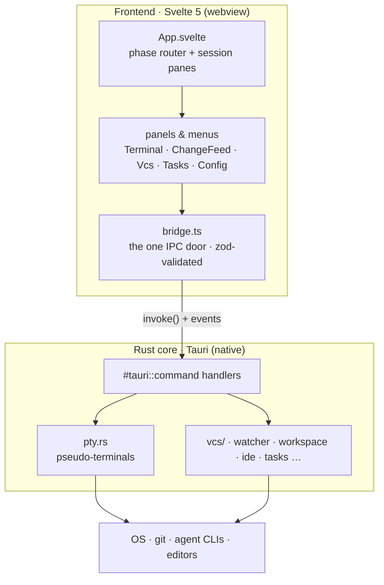
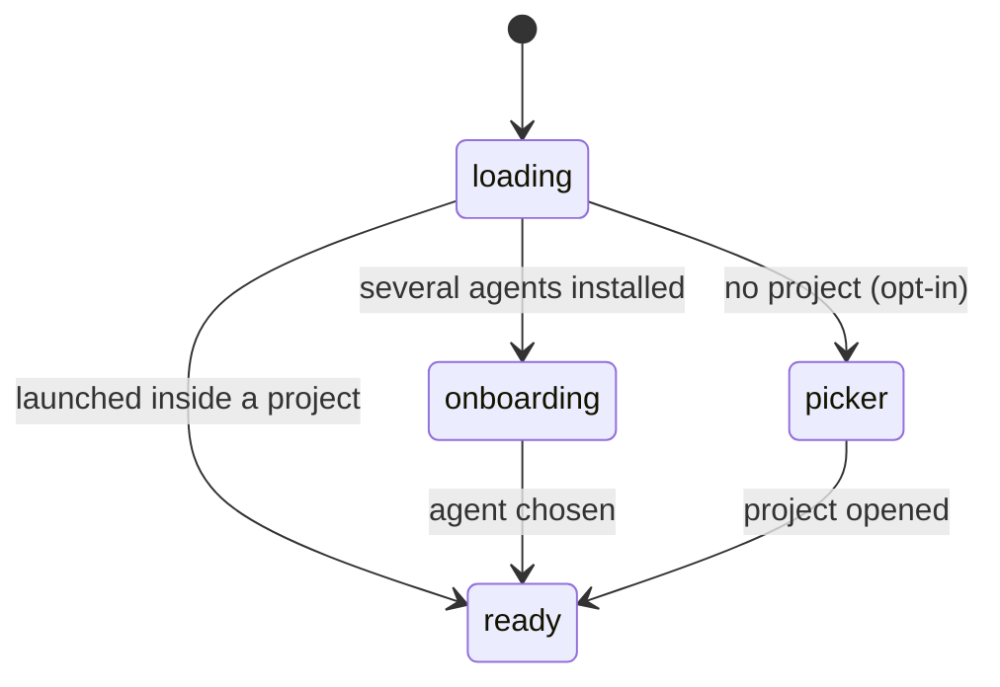
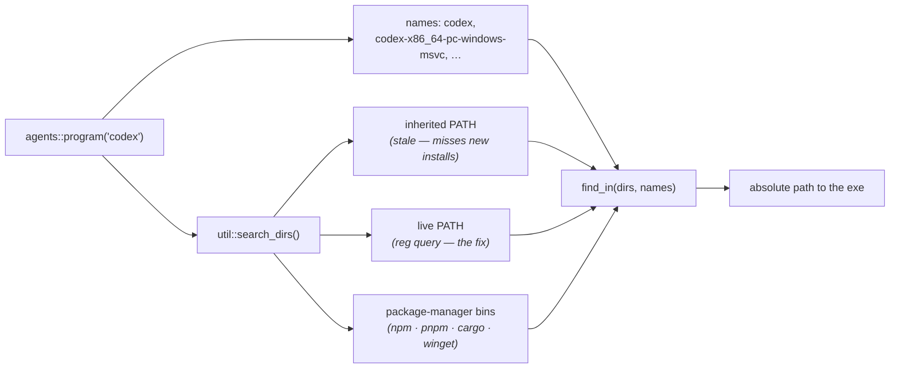
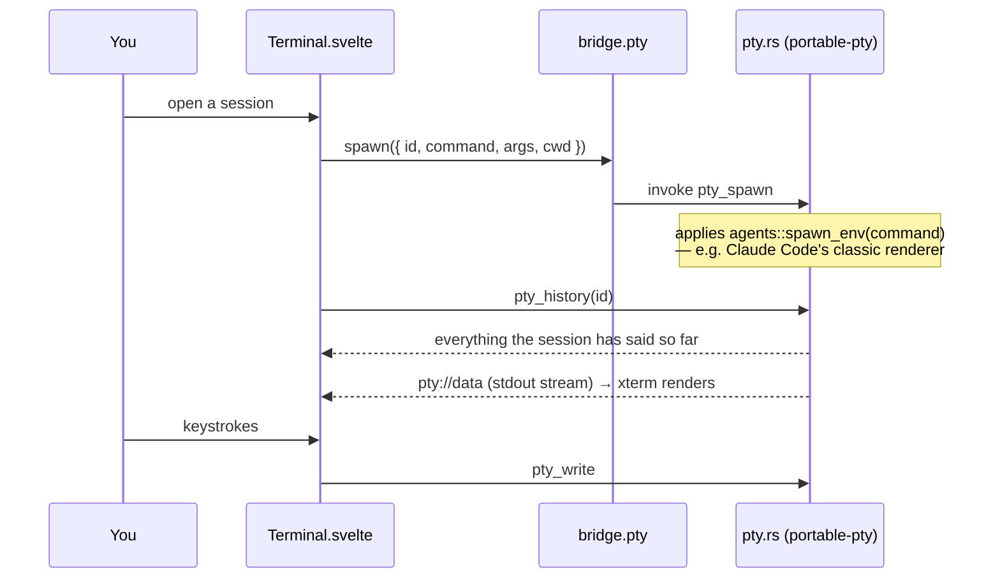
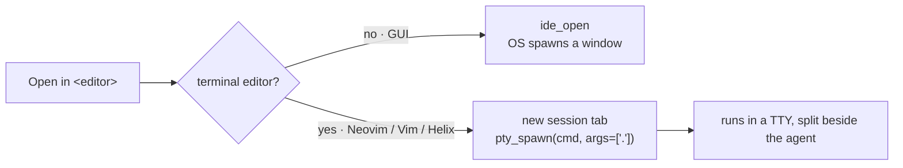

# PADE — architecture map

One-read orientation for agents and humans: every module, its single
responsibility, and who it talks to. `docs/requirements.md` holds the product
spec; `CLAUDE.md` holds the engineering rules. Keep this file in sync when a
module is added, split, or renamed.

Two layers, one boundary: the Svelte frontend never talks to Tauri directly —
every IPC call funnels through `src/lib/bridge.ts`, and every payload shape
lives in `src/lib/types.ts` as a zod schema.

## How it works

PADE wraps an AI coding-agent CLI (Claude Code, Codex, …) running **unmodified in
a real terminal** and builds a comprehension-first GUI around it. The big idea:
the agent writes; you stay the owner. So the screen is a live terminal on the
left and glanceable review panels on the right.

Under the hood there are just **two layers with one door between them**. The
Svelte webview owns everything you see; the Rust core owns everything native
(processes, the filesystem, git). They only ever speak through Tauri IPC, and on
the frontend that traffic is squeezed through a single module — `bridge.ts` —
which validates every payload with zod so bad data fails loudly at the boundary
instead of corrupting a panel.

### Screens are phases

`App.svelte` is a small state machine. It boots into one of three full-window
phases and never shows two at once.

### Finding an installed agent

Detection cannot trust `PATH`. A process inherits its environment **once**, at
launch — and a GUI app inherits it from the Explorer session that started it,
itself born at login. An installer's `PATH` edit lands in the registry, so a
running ADE would never see a CLI the user just installed, and Reload would keep
insisting it isn't there. Nor can detection trust the *name*: winget's Codex
package unpacks OpenAI's release binary verbatim, so on that machine `codex` is
spelled `codex-x86_64-pc-windows-msvc.exe` and no `codex.exe` exists at all.

So `util::search_dirs()` rebuilds the search path from its sources on every
detect — the inherited `PATH`, the **live** `PATH` read back out of the registry,
and the bin directories package managers use (npm, pnpm, cargo, bun, Homebrew,
and each winget package folder) — and `agents::program()` searches it for the
agent's canonical name first, then the `aliases` its installers are known to use.

One resolver, three callers — **detection** (is it installed?), **`pty.rs`** (what
to exec for a session), **`naming.rs`** (what to exec headlessly) — so an agent ADE
can *see* is always one it can *run*. Sessions exec the **absolute path**, never a
bare name: a bare name would be re-resolved by the child against that same stale
`PATH`, and an agent ADE had just listed could fail to start. Per-agent knowledge
(`spawn_env`, `oneshot_invocation`) stays keyed by the canonical command, never by
whichever file an installer happened to lay down.

### A terminal session is the unit of work

Each agent tab is a **session** — an id, the agent to run, and an optional
worktree cwd. `Terminal.svelte` mounts an xterm.js instance per session and asks
the core to spawn a PTY; bytes then stream both ways over Tauri events. All
sessions stay mounted so scrollback survives tab switching.

A spawn for a session that is already running is a no-op, so a terminal may be
mounting onto a conversation **in flight** — a hot-reloaded component, a reloaded
window. A PTY keeps no scrollback of its own, so without a replay that terminal has
nothing to paint and sits blank while the agent, quite happily, waits for input (it
reads as "the agent isn't starting"). `pty.rs` therefore keeps each session's raw
stream and hands it back through `pty_history`. Every chunk carries its position in
the stream, so a frontend already listening to the live feed while it asks for the
history can tell which chunks that history already contains from which are new.

A **fullscreen** program's history is not a document, though — it is a stream of edits
to a framebuffer, and a trimmed one replays as a torn frame. So `pty.rs` also tracks
which screen the program is on, and for the alternate one the terminal replays what it
has and then asks the program to repaint (a one-row resize and back): the program's own
model of the screen is the only complete copy.

### A terminal has two screens, and they invert every rule

How a resize must behave is a property of **which screen the program paints on**, not
of the emulator — and ADE hosts both, so `Terminal.svelte` watches
`buffer.onBufferChange` and switches policy on it.

| | **Normal screen** (a shell, an agent with no fullscreen mode) | **Alternate screen** (Claude Code as ADE runs it, Codex, aider, a pager) |
| --- | --- | --- |
| What it holds | A real document, with real scrollback | A framebuffer the program owns and diffs against its own model of |
| Who paints a row | The terminal — so xterm can rewrap the text itself, continuously, like a web page | **Only the program** |
| Grid refit | Every frame, so the text tracks the drag | **Flow-controlled**: one resize in flight at a time, the next only once the program has finished painting the last (and never more often than `ALT_FIT_MIN_INTERVAL_MS`). Resize it faster than it can follow and its model desyncs — measured, that stops it painting altogether and the pane goes blank for good. Freezing the grid instead would be safe, but then the TUI only updates when you let go |
| `SIGWINCH` | **Width only**, debounced; the height never. An inline document wraps to the width, but how much of it you can see is the terminal's business — and every `SIGWINCH` makes the agent re-lay-out (dropping a line, which steps the text above it) and reprint its whole static history (a per-frame drag left **52** orphaned conversations in the scrollback) | **Cols and rows, immediately.** A size the program has not heard is a row nobody paints |
| Grid anchor | Top while the conversation fits, bottom once it scrolls — pinning the end you are looking at, so the sub-cell remainder and the row xterm scrolls away cancel out | **Top.** The program's frame is rigid, so the unpinned edge is the one that jumps a row on every boundary: pinning the top nails the conversation (measured: not one pixel of movement across three row changes) and leaves the remainder as an invisible strip of terminal background at the bottom. While the program is catching up the grid can be taller than the pane, which would cut its status line off — so it is scaled to fit (~3% at worst), back to exactly 1 the moment it catches up |

ADE runs Claude Code **fullscreen** (`CLAUDE_CODE_NO_FLICKER=1` in the registry): the
polished TUI, with mouse support and flicker-free output. The cost is deliberate — on
the alternate screen a resize cannot flow like a web page, because the content is on
the far side of the PTY. The normal-screen column is not dead code: it is what every
shell session runs, and what Claude Code runs again the moment the renderer is flipped
back.

One xterm patch backs this (`patches/@xterm__xterm@…`), making a row resize a lossless
round trip. Stock, a **shrink** `pop()`s the line below the cursor — while its own
comment claims that line is blank — which destroyed the agent's `accept edits` hint;
and a **grow** refuses to reclaim the scrollback whenever anything sits below the
cursor, pushing blank lines under the conversation instead, so shrink→grow marched the
conversation off the top and left the pane full of dead space.

`docs/terminal-rendering.md` has the measurements and the approaches that were
tried and rejected.

### Opening a project in an editor

"Open in editor" forks on **how the editor runs**. A GUI editor (VS Code,
JetBrains, Zed…) is launched by the OS and detaches into its own window. A
**console editor** (Neovim, Vim, Helix) needs a real TTY, which the OS spawn
can't give it — so PADE opens it in a **new terminal tab** right beside the
agent, reusing the very same PTY machinery sessions use. The `ide.rs` `family()`
table is the single place that knows which editors are terminal-based, and it
also drives add-an-editor validation and jump-to-line launching (DRY).

Everything below is the module-by-module map: each file, its single
responsibility, and who it collaborates with.

## Frontend — app shell

| Module | Responsibility | Collaborators |
| --- | --- | --- |
| `src/main.ts` | Entry: mounts `App`, loads the theme | `App.svelte`, `theme.css` |
| `src/theme.css` | M3 Expressive tokens, global keyframes, base document styles | everything |
| `src/App.svelte` | App-shell orchestrator: phase routing (loading → picker / onboarding / ready), spawned-window boot, session list + split panes, launch flows, side-panel host; wires the extracted concerns below | `SessionTabs`, panels, `autoName`, `stores/handoff`, `workspaceRelocate`, `sendShortcut`, `tabShortcuts`, `stores/toast` |
| `src/lib/SessionTabs.svelte` | Session tab strip: pill/dot/"+N" tiers, off-layout measurement, add-agent menu | `tabFit`, `stores/sessions` |
| `src/lib/AppMenu.svelte` | Top-bar project menu: current dir, recents, switch/open/new-window | `bridge` |
| `src/lib/UsageMeter.svelte` | Agent usage/quota pill in the top bar | `bridge.usage` |
| `src/lib/DesignMenu.svelte` | Quick-launch menu for AI design tools | `bridge.design` |
| `src/lib/IdeMenu.svelte` | Open the project in a detected IDE — GUI editors via the OS, console editors handed back to `App` for a terminal tab | `bridge.ide` |
| `src/lib/RunnerDock.svelte` | Task-runner dock: streaming output rows, resize, pipe-to-agent; keeps its own 2-D-grid pointer drag rather than the single-axis `dragReorder` engine (the dock wraps to multiple rows) | `stores/runners` |
| `src/lib/CommitModal.svelte` | Commit-dialog orchestrator: native `<dialog>` plumbing, header, selection + diff-load state machine | `commitModal/FileList`, `commitModal/DiffPane`, `bridge.vcs`, `diff` |
| `src/lib/commitModal/FileList.svelte` | The commit's changed-files tablist: kind badges, stats, roving-tabindex keys | `paths` |
| `src/lib/commitModal/DiffPane.svelte` | Path bar + unified diff with loading / failed / large-file states (presentation only) | `diff` |
| `src/lib/ConfirmDialog.svelte` | Shared in-app confirmation modal (native `<dialog>`): destructive prompt with caller-owned busy + error states — replaces the OS popup | `Icon` |
| `src/lib/SessionBadge.svelte`, `Icon`, `Logo`, `BrandMark`, `ColorText` | Small presentational atoms | — |

## Frontend — extracted concerns (logic modules)

| Module | Responsibility | Collaborators |
| --- | --- | --- |
| `src/lib/bridge.ts` | The single UI ↔ Rust boundary; zod-validates every response | `types`, `@tauri-apps/api` |
| `src/lib/types.ts` | Zod schemas + TS types for every IPC payload; shared enums | `bridge`, everywhere |
| `src/lib/validate.ts` | User-input schemas (trust boundary) + `parseInput` / `nameError` | form components |
| `src/lib/tabFit.ts` | Pure greedy packing of session tabs into pill/dot/overflow tiers | `SessionTabs` |
| `src/lib/dragReorder.ts` | Pointer-drag FLIP reorder engine (DOM + geometry): lifts a tile, slides its siblings, supports drop-outside-to-split; delegates the pure order/index math to `reorder` | `SessionTabs`, `Terminal`, `reorder` |
| `src/lib/reorder.ts` | Pure, DOM-free order/index math for drag-to-reorder + drop-to-split (`reorderedIds`, `insertionIndex`, `paneInsertIndex`) and the `DropSide` enum | `dragReorder`, `App` |
| `src/lib/autoName.ts` | Temp-workspace auto-naming: distinct-file counting, once-per-workspace naming call | `bridge.feed/workspace`, `paths` |
| `src/lib/workspaceRelocate.ts` | Move/rename/delete with cwd-lock handling: kill locking sessions → backend op → resume remapped (delete has nothing to resume and drops the project) | `bridge`, `stores/sessions`, `stores/context` |
| `src/lib/sendShortcut.ts` | Global send-from-IDE shortcut: clipboard → active agent input | `bridge.pty`, `stores/toast` |
| `src/lib/tabShortcuts.ts` | Tab keyboard shortcuts: pure key-chord → action matcher + capture-phase registrar (new / close / cycle / launch-menu) | `App` |
| `src/lib/paths.ts` | Path helpers: `baseName`, `displayName`, `isTemporaryWorkspace`, `normalizePath` | many |
| `src/lib/diff.ts` | Pure unified-diff parser + side-by-side rows | `ChangeFeed`, `VcsPanel`, `CommitModal` |
| `src/lib/format.ts` | Locale-aware number formatting | UI counts/stats |
| `src/lib/errors.ts` | `errorMessage` — one reading of a thrown IPC rejection into user-facing text | any catch block |
| `src/lib/motion.ts` | `collapseRow` exit transition (the one animation CSS can't own: the node is gone before it could run), reduced-motion aware | picker lists |
| `src/lib/colors.ts` | Color-token detection + `var()` tracing for swatches | `ColorText`, viewers |
| `src/lib/highlight.ts` | Dependency-free syntax highlighting for code/config/diff viewers | viewers |
| `src/lib/prefs.svelte.ts` | Reactive appearance/editor prefs, applied as CSS custom properties | `App`, `bridge` |

## Frontend — stores (cross-component state)

| Module | Responsibility |
| --- | --- |
| `src/lib/stores/sessions.svelte.ts` | Per-session status (working/ready/exited) |
| `src/lib/stores/context.svelte.ts` | Per-session context-window percentage |
| `src/lib/stores/handoff.svelte.ts` | Auto-handoff: near-limit scan, handoff-doc wait, successor launch |
| `src/lib/stores/runners.svelte.ts` | Task-runner rows + backend stream subscription |
| `src/lib/stores/sidePanel.svelte.ts` | Active side-panel header (count + refresh action) |
| `src/lib/stores/toast.svelte.ts` | Transient status toast (single reset-on-show timer) |

## Frontend — panels

| Module | Responsibility |
| --- | --- |
| `src/panels/Terminal.svelte` | xterm.js terminal bound to one PTY session; owns the document-style reflow (grid fit, anchor, settle-debounced `SIGWINCH`) |
| `src/panels/ChangeFeed.svelte` | Live file-change feed with inline diffs |
| `src/panels/VcsPanel.svelte` | Git-panel orchestrator: fetch + watcher-debounced refresh + panel header; composes the sections below |
| `src/panels/TasksPanel.svelte` | Detected project tasks, run as dock runners |
| `src/panels/ConfigPanel.svelte` | Read-only view of the active agent's config files |
| `src/panels/Onboarding.svelte` | Agent picker when several agents could open a project |
| `src/panels/ProjectPicker.svelte` | Picker orchestrator: owns settings + refresh + the shared workspace lifecycle, hosts the delete `ConfirmDialog`, and keeps the page live — it watches the parents of its rows (`dirs`) and re-prunes on any change, so a folder deleted outside PADE leaves the list on its own; composes the sections below |

### Git-panel sections (`src/panels/vcs/`)

| Module | Responsibility |
| --- | --- |
| `chrome.css` | Shared panel chrome (group headers, sha/author line, empty state), selector-scoped under `.vcs` |
| `RestoreSection.svelte` | Restore a version: natural-language query → ranked candidates → checkout |
| `ChangesSection.svelte` | Unreviewed/staged groups + the selected file's inline diff (unified + split) |
| `CommitLog.svelte` | Recent commits with keyboard navigation, GitHub links and the detail modal |

### Project-picker sections (`src/panels/picker/`)

| Module | Responsibility |
| --- | --- |
| `chrome.css` | Shared picker chrome (base fields/buttons, kebab + popover menus, rows, eyebrows), selector-scoped under `.picker` so all sections inherit one copy |
| `QuickStartSection.svelte` | Temp-workspace card + create-a-project form |
| `OnLaunchSection.svelte` | Start-mode toggle, auto-name checkbox, Explorer context-menu toggle |
| `RecentSection.svelte` | Recent rows with tags + inline-rename form; a removed row collapses out (`motion.collapseRow`) |
| `AgentsSection.svelte` | Default-agent chips with rescan/skeleton states |
| `EditorsSection.svelte` | Editor-rules engine rows + popover selects + "Add editor…" by executable path (validated, inline status) |
| `RootsSection.svelte` | Root folders: add/remove + detected projects per root |
| `RowMenu.svelte` | Shared kebab popover: reveal actions + owned-workspace lifecycle entries |
| `lifecycle.svelte.ts` | Owned-workspace rename/move/delete flows + inline-rename form state, shared by Recent and Roots; owns the delete confirmation state (target / in-flight / error) that `ProjectPicker` renders as one `ConfirmDialog` |

## Rust core (`src-tauri/src/`)

`lib.rs` only wires modules and registers commands; `main.rs` is the binary
entry. Each concern is one module:

| Module | Responsibility |
| --- | --- |
| `pty.rs` | PTY host — runs agent CLIs (and console editors) unmodified in pseudo-terminals (portable-pty), applying the registry's per-agent spawn env; keeps each session's replayable history so a terminal can attach to a conversation in flight; dropping a session kills **and reaps** its child (closing the PTY only hangs it up, and a survivor keeps its cwd locked), so `pty_kill` frees the workspace and `kill_all` leaves nothing behind on app exit |
| `watcher.rs` | Filesystem watchers (notify): the recursive one feeding the Change Feed, and `watch_dirs` — the picker's, watching the *parents* of the rows it shows (watching a row would hold a handle on it and block its deletion) and emitting `dirs://changed` when one gains or loses a child |
| `vcs/` | Git backend, one concern per submodule: `mod.rs` (shared git runner + status-kind vocabulary), `status` (working-tree status + diff), `log`, `inspect` (one commit's detail + per-file diff), `remote` (browse-URL normalization), `branches`, `worktree`, `restore` (natural-language ranking + checkout) |
| `workspace.rs` | Settings, roots, temp workspaces, labels, move/rename/delete. Deleting first steps the process out of the folder (opening a project chdirs into it, and Windows won't delete the directory a process stands in), then retries briefly while the OS closes the killed agents' handles; an already-absent folder counts as deleted, so a stale Recent row can always be cleared |
| `refs.rs` | After a move: re-point agent memory dirs, IDE recents, symlinks, package-manager installs |
| `naming.rs` | Temp-workspace auto-naming (agent CLI → heuristic, shared sanitizer) |
| `agents.rs` | Agent registry + detection, one-shot headless invocations, and the env each agent is spawned with (e.g. Claude Code's classic renderer — see "The terminal reflows like a document"). `program()` is the one place that turns an agent's name into the executable to run — see "Finding an installed agent" |
| `usage.rs` | Agent usage / quota meter |
| `ide.rs` | Editor detection + user-added editors, per-kind suggestion rules, open-at-line; one `family()` table also flags console editors that run in a terminal tab |
| `tasks.rs` | Discover runnable tasks from project manifests |
| `runner.rs` | Task-runner execution with streamed output |
| `config.rs` | Surface (read-only) the config files each agent CLI uses |
| `design.rs` | Quick-launch AI design / UI-generation tools |
| `contextmenu.rs` | Windows Explorer "Open in PADE" registration |
| `os.rs` | Reveal in file manager / terminal, open URLs |
| `window.rs` | Spawn additional app windows; paint each window's webview with the themed M3 surface so it opens in-theme (no white flash) |
| `copilot.rs` | Copilot as an optional name source (stub, not yet wired) |
| `util.rs` | Cross-cutting helpers: executable resolution (`search_dirs`, `find_in`, `resolve`, `is_on_path`), `home_dir`, `encode_project` |

## Tests

`pnpm test` runs both sides: `test:js` (vitest, colocated `*.test.ts` next to
each pure module) and `test:rust` (`cargo test`, `#[cfg(test)]` modules inside
`naming.rs`, `refs.rs`, `ide.rs` and the `vcs/` parsers). The pure logic
extracted from components —
`tabFit`, `diff`, `paths`, `colors`, `format`, `reorder`, `validate`, `autoName`'s
signal detection, `workspaceRelocate`'s path remapping, `handoff`'s slug,
`tabShortcuts`'s chord matching — is where
new tests belong first: they run in milliseconds and need no window.
