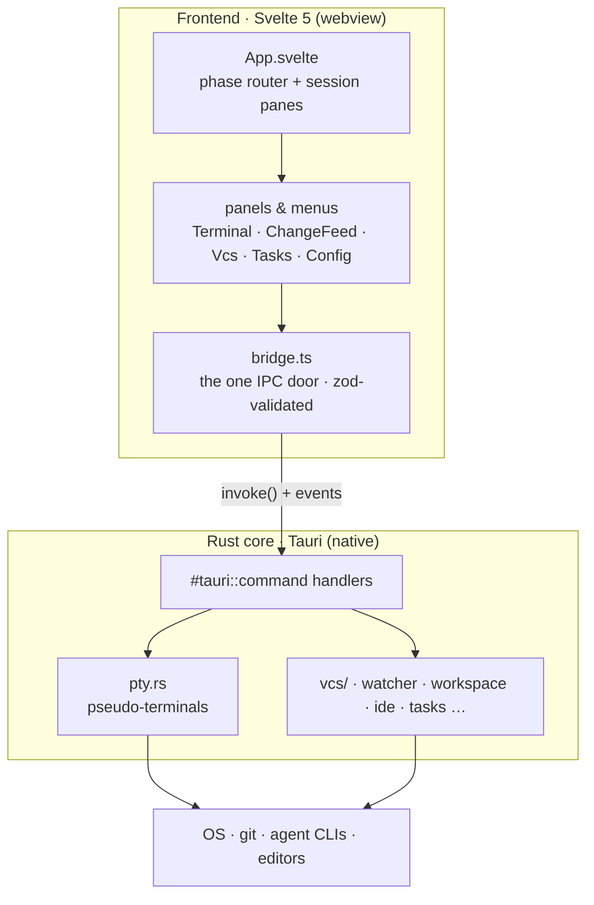
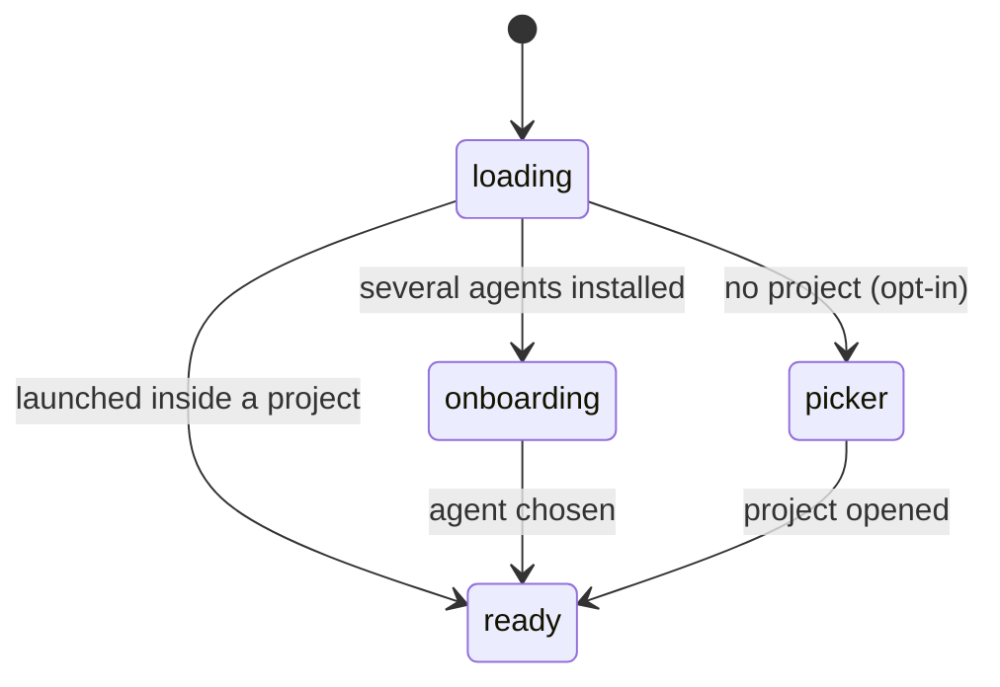
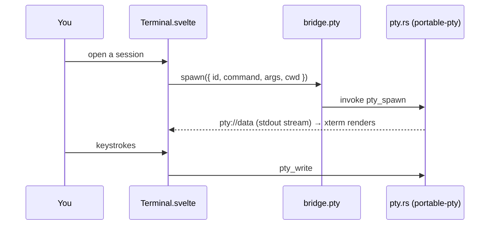
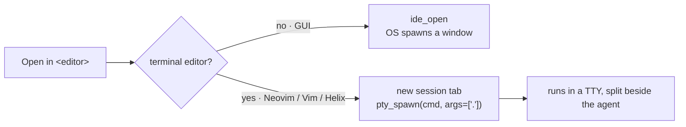

# PADE — architecture map

One-read orientation for agents and humans: every module, its single
responsibility, and who it talks to. `docs/requirements.md` holds the product
spec; `CLAUDE.md` holds the engineering rules. Keep this file in sync when a
module is added, split, or renamed.

Two layers, one boundary: the Svelte frontend never talks to Tauri directly —
every IPC call funnels through `src/lib/bridge.ts`, and every payload shape
lives in `src/lib/types.ts` as a zod schema.

## How it works

PADE wraps an AI coding-agent CLI (Claude Code, Codex, …) running **unmodified in
a real terminal** and builds a comprehension-first GUI around it. The big idea:
the agent writes; you stay the owner. So the screen is a live terminal on the
left and glanceable review panels on the right.

Under the hood there are just **two layers with one door between them**. The
Svelte webview owns everything you see; the Rust core owns everything native
(processes, the filesystem, git). They only ever speak through Tauri IPC, and on
the frontend that traffic is squeezed through a single module — `bridge.ts` —
which validates every payload with zod so bad data fails loudly at the boundary
instead of corrupting a panel.

### Screens are phases

`App.svelte` is a small state machine. It boots into one of three full-window
phases and never shows two at once.

### A terminal session is the unit of work

Each agent tab is a **session** — an id, the agent to run, and an optional
worktree cwd. `Terminal.svelte` mounts an xterm.js instance per session and asks
the core to spawn a PTY; bytes then stream both ways over Tauri events. All
sessions stay mounted so scrollback survives tab switching.

### Opening a project in an editor

"Open in editor" forks on **how the editor runs**. A GUI editor (VS Code,
JetBrains, Zed…) is launched by the OS and detaches into its own window. A
**console editor** (Neovim, Vim, Helix) needs a real TTY, which the OS spawn
can't give it — so PADE opens it in a **new terminal tab** right beside the
agent, reusing the very same PTY machinery sessions use. The `ide.rs` `family()`
table is the single place that knows which editors are terminal-based, and it
also drives add-an-editor validation and jump-to-line launching (DRY).

Everything below is the module-by-module map: each file, its single
responsibility, and who it collaborates with.

## Frontend — app shell

| Module | Responsibility | Collaborators |
| --- | --- | --- |
| `src/main.ts` | Entry: mounts `App`, loads the theme | `App.svelte`, `theme.css` |
| `src/theme.css` | M3 Expressive tokens, global keyframes, base document styles | everything |
| `src/App.svelte` | App-shell orchestrator: phase routing (loading → picker / onboarding / ready), spawned-window boot, session list + split panes, launch flows, side-panel host; wires the extracted concerns below | `SessionTabs`, panels, `autoName`, `stores/handoff`, `workspaceRelocate`, `sendShortcut`, `tabShortcuts`, `stores/toast` |
| `src/lib/SessionTabs.svelte` | Session tab strip: pill/dot/"+N" tiers, off-layout measurement, add-agent menu | `tabFit`, `stores/sessions` |
| `src/lib/AppMenu.svelte` | Top-bar project menu: current dir, recents, switch/open/new-window | `bridge` |
| `src/lib/UsageMeter.svelte` | Agent usage/quota pill in the top bar | `bridge.usage` |
| `src/lib/DesignMenu.svelte` | Quick-launch menu for AI design tools | `bridge.design` |
| `src/lib/IdeMenu.svelte` | Open the project in a detected IDE — GUI editors via the OS, console editors handed back to `App` for a terminal tab | `bridge.ide` |
| `src/lib/RunnerDock.svelte` | Task-runner dock: streaming output rows, resize, pipe-to-agent | `stores/runners` |
| `src/lib/CommitModal.svelte` | Commit-dialog orchestrator: native `<dialog>` plumbing, header, selection + diff-load state machine | `commitModal/FileList`, `commitModal/DiffPane`, `bridge.vcs`, `diff` |
| `src/lib/commitModal/FileList.svelte` | The commit's changed-files tablist: kind badges, stats, roving-tabindex keys | `paths` |
| `src/lib/commitModal/DiffPane.svelte` | Path bar + unified diff with loading / failed / large-file states (presentation only) | `diff` |
| `src/lib/SessionBadge.svelte`, `Icon`, `Logo`, `BrandMark`, `ColorText` | Small presentational atoms | — |

## Frontend — extracted concerns (logic modules)

| Module | Responsibility | Collaborators |
| --- | --- | --- |
| `src/lib/bridge.ts` | The single UI ↔ Rust boundary; zod-validates every response | `types`, `@tauri-apps/api` |
| `src/lib/types.ts` | Zod schemas + TS types for every IPC payload; shared enums | `bridge`, everywhere |
| `src/lib/validate.ts` | User-input schemas (trust boundary) + `parseInput` / `nameError` | form components |
| `src/lib/tabFit.ts` | Pure greedy packing of session tabs into pill/dot/overflow tiers | `SessionTabs` |
| `src/lib/autoName.ts` | Temp-workspace auto-naming: distinct-file counting, once-per-workspace naming call | `bridge.feed/workspace`, `paths` |
| `src/lib/workspaceRelocate.ts` | Move/rename with cwd-lock handling: kill locking sessions → backend op → resume remapped | `bridge`, `stores/sessions`, `stores/context` |
| `src/lib/sendShortcut.ts` | Global send-from-IDE shortcut: clipboard → active agent input | `bridge.pty`, `stores/toast` |
| `src/lib/tabShortcuts.ts` | Tab keyboard shortcuts: pure key-chord → action matcher + capture-phase registrar (new / close / cycle / launch-menu) | `App` |
| `src/lib/paths.ts` | Path helpers: `baseName`, `displayName`, `isTemporaryWorkspace`, `normalizePath` | many |
| `src/lib/diff.ts` | Pure unified-diff parser + side-by-side rows | `ChangeFeed`, `VcsPanel`, `CommitModal` |
| `src/lib/format.ts` | Locale-aware number formatting | UI counts/stats |
| `src/lib/colors.ts` | Color-token detection + `var()` tracing for swatches | `ColorText`, viewers |
| `src/lib/highlight.ts` | Dependency-free syntax highlighting for code/config/diff viewers | viewers |
| `src/lib/prefs.svelte.ts` | Reactive appearance/editor prefs, applied as CSS custom properties | `App`, `bridge` |

## Frontend — stores (cross-component state)

| Module | Responsibility |
| --- | --- |
| `src/lib/stores/sessions.svelte.ts` | Per-session status (working/ready/exited) |
| `src/lib/stores/context.svelte.ts` | Per-session context-window percentage |
| `src/lib/stores/handoff.svelte.ts` | Auto-handoff: near-limit scan, handoff-doc wait, successor launch |
| `src/lib/stores/runners.svelte.ts` | Task-runner rows + backend stream subscription |
| `src/lib/stores/sidePanel.svelte.ts` | Active side-panel header (count + refresh action) |
| `src/lib/stores/toast.svelte.ts` | Transient status toast (single reset-on-show timer) |

## Frontend — panels

| Module | Responsibility |
| --- | --- |
| `src/panels/Terminal.svelte` | xterm.js terminal bound to one PTY session |
| `src/panels/ChangeFeed.svelte` | Live file-change feed with inline diffs |
| `src/panels/VcsPanel.svelte` | Git-panel orchestrator: fetch + watcher-debounced refresh + panel header; composes the sections below |
| `src/panels/TasksPanel.svelte` | Detected project tasks, run as dock runners |
| `src/panels/ConfigPanel.svelte` | Read-only view of the active agent's config files |
| `src/panels/Onboarding.svelte` | Agent picker when several agents could open a project |
| `src/panels/ProjectPicker.svelte` | Picker orchestrator: owns settings + refresh + the shared workspace lifecycle; composes the sections below |

### Git-panel sections (`src/panels/vcs/`)

| Module | Responsibility |
| --- | --- |
| `chrome.css` | Shared panel chrome (group headers, sha/author line, empty state), selector-scoped under `.vcs` |
| `RestoreSection.svelte` | Restore a version: natural-language query → ranked candidates → checkout |
| `ChangesSection.svelte` | Unreviewed/staged groups + the selected file's inline diff (unified + split) |
| `CommitLog.svelte` | Recent commits with keyboard navigation, GitHub links and the detail modal |

### Project-picker sections (`src/panels/picker/`)

| Module | Responsibility |
| --- | --- |
| `chrome.css` | Shared picker chrome (base fields/buttons, kebab + popover menus, rows, eyebrows), selector-scoped under `.picker` so all sections inherit one copy |
| `QuickStartSection.svelte` | Temp-workspace card + create-a-project form |
| `OnLaunchSection.svelte` | Start-mode toggle, auto-name checkbox, Explorer context-menu toggle |
| `RecentSection.svelte` | Recent rows with tags + inline-rename form |
| `AgentsSection.svelte` | Default-agent chips with rescan/skeleton states |
| `EditorsSection.svelte` | Editor-rules engine rows + popover selects + "Add editor…" by executable path (validated, inline status) |
| `RootsSection.svelte` | Root folders: add/remove + detected projects per root |
| `RowMenu.svelte` | Shared kebab popover: reveal actions + owned-workspace lifecycle entries |
| `lifecycle.svelte.ts` | Owned-workspace rename/move/delete flows + inline-rename form state, shared by Recent and Roots |

## Rust core (`src-tauri/src/`)

`lib.rs` only wires modules and registers commands; `main.rs` is the binary
entry. Each concern is one module:

| Module | Responsibility |
| --- | --- |
| `pty.rs` | PTY host — runs agent CLIs (and console editors) unmodified in pseudo-terminals (portable-pty); `kill_all` terminates every session on app exit (wired in `lib.rs`'s run loop) so no agent lingers |
| `watcher.rs` | Filesystem watcher feeding the Change Feed (notify) |
| `vcs/` | Git backend, one concern per submodule: `mod.rs` (shared git runner + status-kind vocabulary), `status` (working-tree status + diff), `log`, `inspect` (one commit's detail + per-file diff), `remote` (browse-URL normalization), `branches`, `worktree`, `restore` (natural-language ranking + checkout) |
| `workspace.rs` | Settings, roots, temp workspaces, labels, move/rename/delete |
| `refs.rs` | After a move: re-point agent memory dirs, IDE recents, symlinks, package-manager installs |
| `naming.rs` | Temp-workspace auto-naming (agent CLI → heuristic, shared sanitizer) |
| `agents.rs` | Agent registry + detection, one-shot headless invocations |
| `usage.rs` | Agent usage / quota meter |
| `ide.rs` | Editor detection + user-added editors, per-kind suggestion rules, open-at-line; one `family()` table also flags console editors that run in a terminal tab |
| `tasks.rs` | Discover runnable tasks from project manifests |
| `runner.rs` | Task-runner execution with streamed output |
| `config.rs` | Surface (read-only) the config files each agent CLI uses |
| `design.rs` | Quick-launch AI design / UI-generation tools |
| `contextmenu.rs` | Windows Explorer "Open in PADE" registration |
| `os.rs` | Reveal in file manager / terminal, open URLs |
| `window.rs` | Spawn additional app windows; paint each window's webview with the themed M3 surface so it opens in-theme (no white flash) |
| `copilot.rs` | Copilot as an optional name source (stub, not yet wired) |
| `util.rs` | Cross-cutting helpers: `is_on_path`, `home_dir`, `encode_project` |

## Tests

`pnpm test` runs both sides: `test:js` (vitest, colocated `*.test.ts` next to
each pure module) and `test:rust` (`cargo test`, `#[cfg(test)]` modules inside
`naming.rs`, `refs.rs`, `ide.rs` and the `vcs/` parsers). The pure logic
extracted from components —
`tabFit`, `diff`, `paths`, `colors`, `format`, `validate`, `autoName`'s signal
detection, `workspaceRelocate`'s path remapping, `handoff`'s slug,
`tabShortcuts`'s chord matching — is where
new tests belong first: they run in milliseconds and need no window.
